# 众翼云鉴：智能鸟类摄享平台 — 系统设计规约

---

## 目 录

1. [引言](#1-引言)
2. [系统架构](#2-系统架构)
3. [模块设计](#3-模块设计)
4. [API 设计](#4-api-设计)
5. [安全设计](#5-安全设计)
6. [部署设计](#6-部署设计)

---

## 1. 引言

### 1.1 编写目的

本文档描述"众翼云鉴：智能鸟类摄享平台"的系统设计规约，包括系统架构、模块划分、数据库设计、API 接口规范、安全机制与部署策略，为项目开发、测试、部署与后续维护提供技术依据。

### 1.2 适用范围

本文档面向项目开发团队、测试团队与运维人员。

### 1.3 术语与定义

| 术语 | 定义 |
|------|------|
| SDS | Software Design Specification，系统设计规约 |
| SRS | Software Requirements Specification，系统需求规约 |
| SPA | Single Page Application，单页应用 |
| ORM | Object-Relational Mapping，对象关系映射 |
| DI | Dependency Injection，依赖注入 |

---

## 2. 系统架构

### 2.1 总体架构

系统采用**前后端分离的单体 Web 应用架构**，分为浏览器层、反向代理层、后端服务层与数据存储层。

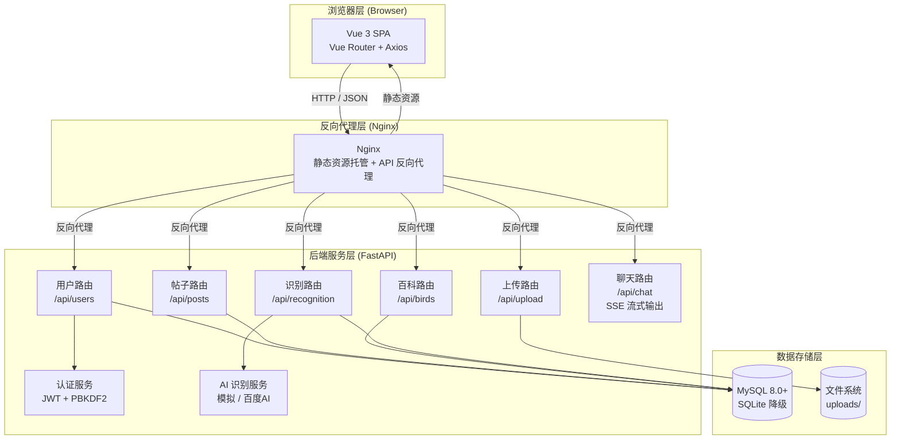

### 2.2 技术栈总览

| 层级 | 技术 | 版本 | 用途 |
|:----:|------|:----:|------|
| **前端框架** | Vue 3 | 3.4.x | SPA 构建（Composition API） |
| **前端构建** | Vite | 5.4.x | HMR + 生产构建 |
| **前端路由** | Vue Router 4 | 4.3.x | 路由表 + 导航守卫 |
| **HTTP 客户端** | Axios | 1.7.x | 拦截器自动注入 Token |
| **样式** | SCSS | — | 全局变量 + 组件样式 |
| **后端框架** | FastAPI | — | 异步路由 + 自动 OpenAPI |
| **ORM** | SQLAlchemy | 2.0 | 声明式模型 + 会话管理 |
| **认证** | python-jose + passlib | — | JWT HS256 + PBKDF2 |
| **数据库** | MySQL / SQLite | 8.0+ | 主存储 / 降级方案 |
| **AI 聊天** | httpx | — | 异步 HTTP 客户端，代理 DeepSeek API（SSE 流式） |
| **测试** | pytest | — | 60+ 测试用例 |

### 2.3 架构设计决策

| 决策 | 方案 | 理由 |
|------|------|------|
| 单体 vs 微服务 | **单体** | 项目规模适中，单体架构更简单，部署运维成本低 |
| 前后端分离 | **是** | 独立开发部署、各自扩展、前端可独立交付 |
| SPA vs SSR | **SPA** | 项目以浏览/操作为主，SEO 需求不强 |
| 数据库自动降级 | **MySQL + SQLite** | 降低环境依赖，开发/演示无需安装 MySQL |
| 认证方案 | **JWT** | 无状态、跨域友好、适合前后端分离 |
| 密码哈希 | **PBKDF2** | 无需编译 C 扩展，跨平台兼容性好 |

---

## 3. 模块设计

### 3.1 整体模块划分

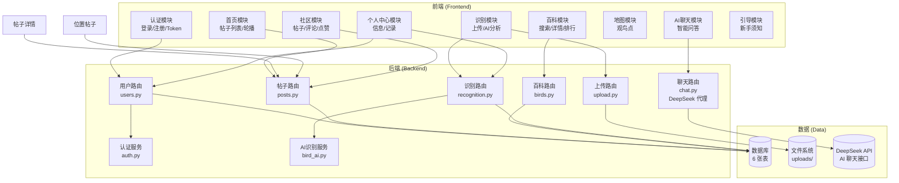

### 3.2 前端模块设计

#### 3.2.1 项目结构

```
frontend/src/
├── main.js                    # 入口：挂载 App + Router
├── App.vue                    # 根组件（TabBar + router-view）
├── router/index.js            # 12 条路由 + 导航守卫
├── stores/auth.js             # 响应式认证状态
├── api/services/              # API 封装层
│   ├── user.js / post.js / bird.js
│   ├── recognition.js / upload.js
│   └── aiChatService.js
├── config/                    # 环境配置
│   ├── api.js / ai.js / oss.js
├── pages/                     # 12 个页面组件
│   ├── HomePage/ LoginPage/ RegisterPage/
│   ├── UploadPage/ BirdEncyclopedia/
│   ├── RankingPage/ AIChat/ MapPage/
│   ├── ProfilePage/ NoobPage/
│   ├── PostDetail/            # 帖子详情（/post/:id）
│   └── LocationPosts/         # 位置帖子（/location-posts）
├── components/                # 共享组件
│   ├── TabBar.vue / HomePoster.vue
│   ├── EnhancedPoster.vue
│   ├── CreatePostModal.vue    # 发帖弹窗
│   ├── BirdKnowledgeCard.vue / OSSImage.vue
├── utils/                     # 工具层
│   ├── request.js / storage.js
│   ├── toast.js / helpers.js / eventBus.js
└── styles/                    # 全局样式
```

#### 3.2.2 路由设计

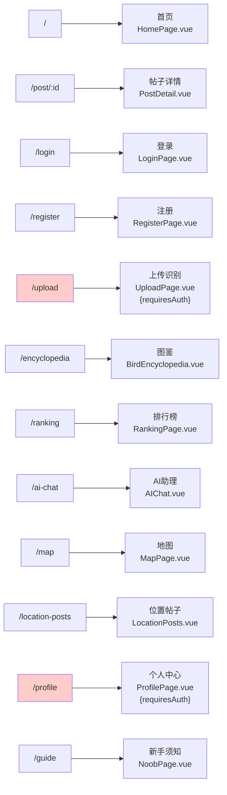

**路由守卫逻辑**：
- `requiresAuth` = true 的路由 → 未登录跳转 `/login?redirect=xxx`
- 已登录用户访问登录/注册页 → 自动重定向首页

#### 3.2.3 认证状态管理

采用 Vue 3 `reactive()` + `computed()` 实现零外部依赖的认证状态：

```
auth store:
├── token: string          # JWT Token（localStorage 持久化）
├── user: UserInfo         # 当前用户信息
├── isAuthenticated        # computed: !!token
├── login(token, user)     # 写状态 → 持久化 storage
├── logout()               # 清状态 → 跳转 /login
└── checkAuth()            # 初始化从 storage 恢复
```

**Axios 拦截器**：
```
request  → 拦截器: 自动附加 Authorization: Bearer <token>
response → 拦截器: 401 时自动调用 logout()

```

### 3.3 后端模块设计

#### 3.3.1 项目结构

```
app/
├── main.py                  # 应用入口：生命周期 + CORS + 路由注册
├── config.py                # 环境配置（Pydantic BaseSettings）
├── database.py              # 数据库引擎（MySQL 优先 / SQLite 降级）
├── models.py                # SQLAlchemy 模型（6 张表）
├── schemas.py               # Pydantic 请求/响应模型
├── utils.py                 # 工具函数（文件上传）
├── routers/                 # 路由层（6 个模块）
│   ├── users.py             # 用户：注册/登录/信息
│   ├── posts.py             # 帖子：CRUD + 点赞 + 评论
│   ├── birds.py             # 百科：搜索/排行/详情
│   ├── upload.py            # 上传：文件校验 + 存储
│   ├── recognition.py       # 识别：分析记录
│   └── chat.py              # AI 聊天：代理 DeepSeek API（SSE 流式）
└── services/                # 服务层
    ├── auth.py              # JWT 签发/验证 + PBKDF2 哈希
    └── bird_ai.py           # AI 识别（模拟 / 百度AI 预留）
```

#### 3.3.2 依赖注入关系

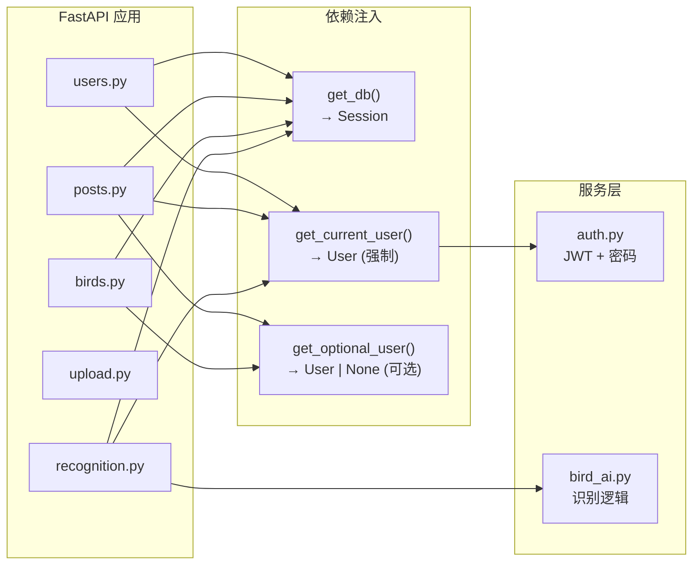

**应用生命周期**：
```
FastAPI 启动
  ├── config.py → 读取环境变量
  ├── database.py → init_db()
  │   ├── 尝试 MySQL 连接 → 成功则使用 MySQL
  │   └── 失败 → 自动切换到 SQLite
  ├── create_all() → 建表
  ├── CORSMiddleware → 跨域配置
  ├── include_router × 6 → 注册路由（含 chat.py）
  └── StaticFiles → 挂载 uploads/ 目录
```

### 3.4 数据库设计

#### 3.4.1 实体关系图

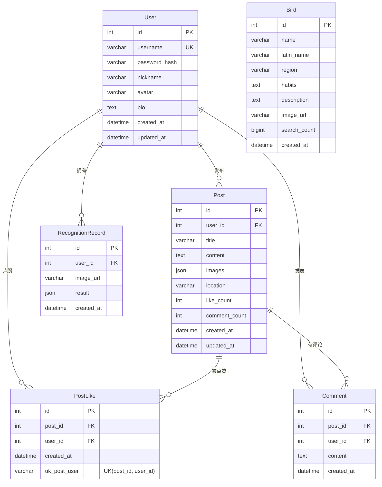

#### 3.4.2 表结构详述

| 表名 | 记录数（预估） | IFPUG 映射 | 关键索引 |
|------|:------------:|:----------:|---------|
| `users` | 用户账户 | ILF-1 | `username`（UNIQUE） |
| `posts` | 摄影帖子 | ILF-4 | `user_id`、`created_at` |
| `post_likes` | 点赞关系 | ILF-6 | `uk_post_user`（UNIQUE） |
| `comments` | 评论记录 | ILF-5 | `post_id`、`user_id` |
| `birds` | 百科物种 | ILF-2 | `name`、`search_count`（DESC） |
| `recognition_records` | 识别历史 | ILF-3 | `user_id`、`created_at` |

#### 3.4.3 实体与 IFPUG 对照

| ILF ID | 名称 | 表 | DET | 状态 |
|:------:|------|:---:|:---:|:----:|
| ILF-1 | 用户信息 | `users` | 14 | ✅ |
| ILF-2 | 鸟类百科 | `birds` | 16 | ✅ |
| ILF-3 | 识别记录 | `recognition_records` | 10 | ✅ |
| ILF-4 | 社区帖子 | `posts` | 13 | ✅ |
| ILF-5 | 评论数据 | `comments` | 8 | ✅ |
| ILF-6 | 点赞数据 | `post_likes` | 6 | ✅ |
| ILF-7 | 收藏数据 | — | — | 📋 |
| ILF-8 | 聊天记录 | — | — | 📋 |
| ILF-9 | 观鸟点 | — | — | 📋 |

### 3.5 类图设计

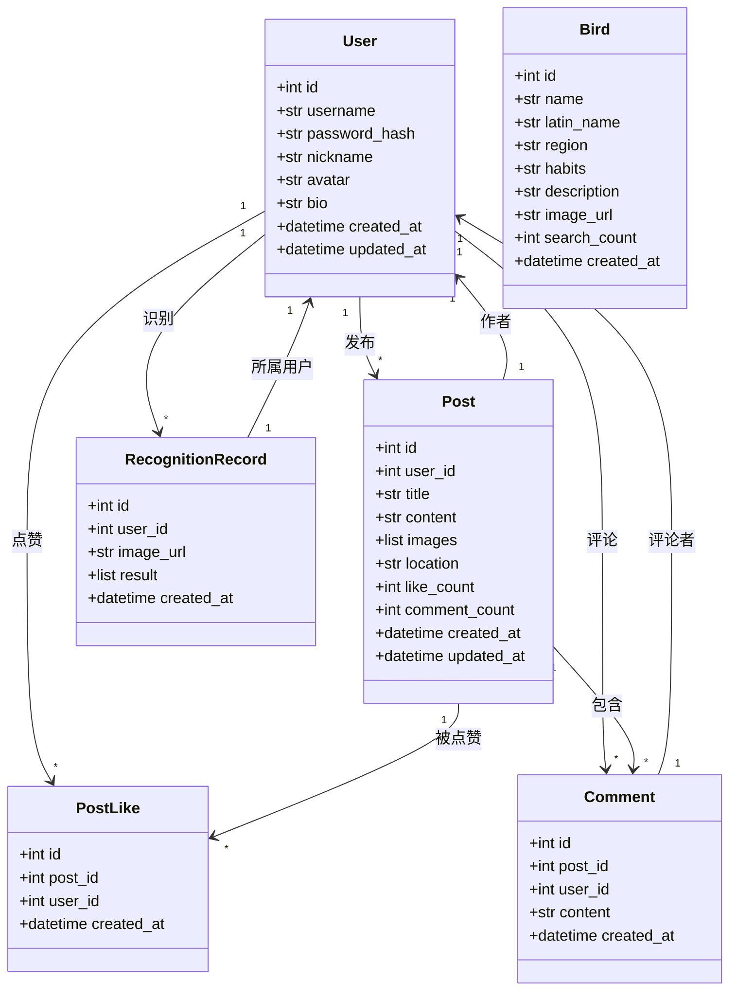

### 3.6 时序图设计

#### 3.6.1 用户注册流程

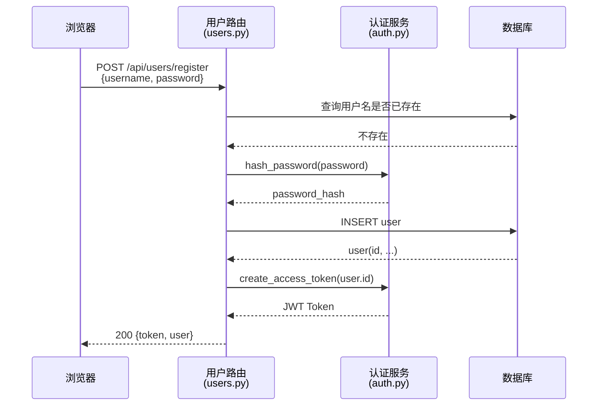

#### 3.6.2 鸟类识别流程

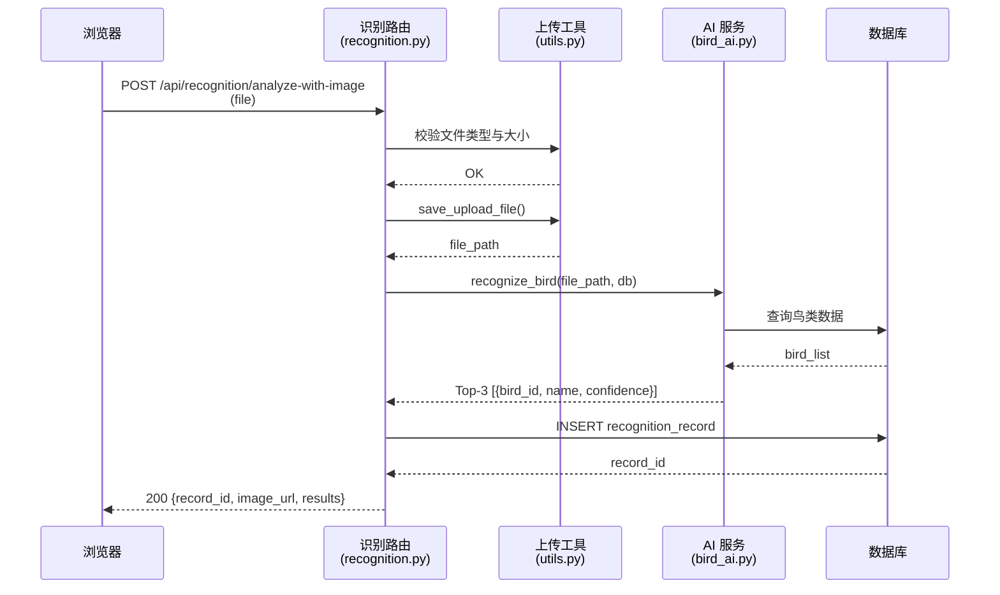

#### 3.6.3 点赞流程

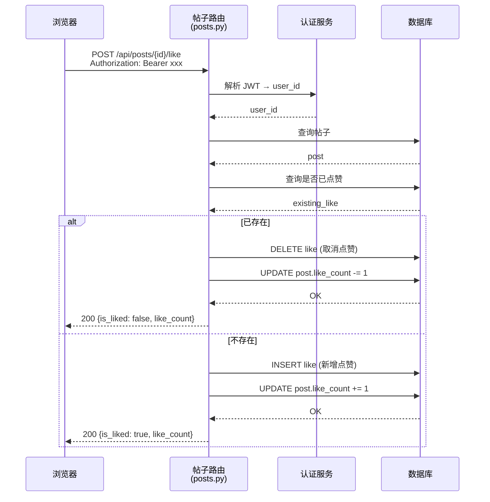

#### 3.6.4 搜索鸟类流程

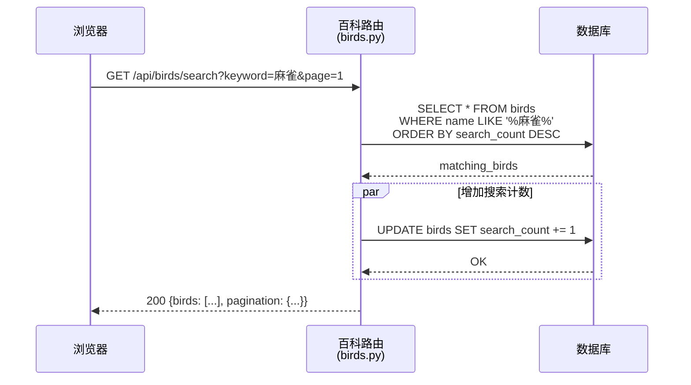

---

## 4. API 设计

### 4.1 完整 API 清单

#### 4.1.1 用户服务（/api/users）

| 方法 | 路径 | 认证 | 功能 | 请求体 | 响应 |
|:----:|------|:---:|------|--------|------|
| POST | `/api/users/register` | — | 注册 | `{username, password}` | `{token, user}` |
| POST | `/api/users/login` | — | 登录 | `{username, password}` | `{token, user}` |
| GET | `/api/users/me` | ✓ | 当前用户信息 | — | `UserInfo` |
| PUT | `/api/users/me` | ✓ | 更新资料 | `{nickname?, bio?, avatar?}` | `UserInfo` |
| GET | `/api/users/{id}` | — | 指定用户信息 | — | `UserInfo` |

#### 4.1.2 社区帖子服务（/api/posts）

| 方法 | 路径 | 认证 | 功能 | 请求体 | 响应 |
|:----:|------|:---:|------|--------|------|
| POST | `` | ✓ | 创建帖子 | `{title, content?, images?, location?}` | `PostInfo` |
| GET | `` | — | 帖子列表 | `?page&page_size` | `{items, pagination}` |
| GET | `/{id}` | — | 帖子详情 | — | `PostInfo` |
| PUT | `/{id}` | ✓ | 更新帖子 | `{title?, content?, images?, location?}` | `PostInfo` |
| DELETE | `/{id}` | ✓ | 删除帖子 | — | — |
| POST | `/{id}/like` | ✓ | 点赞切换 | — | `{is_liked, like_count}` |
| GET | `/{id}/comments` | — | 评论列表 | `?page&page_size` | `{items, pagination}` |
| POST | `/{id}/comments` | ✓ | 发表评论 | `{content}` | `CommentInfo` |

#### 4.1.3 鸟类百科服务（/api/birds）

| 方法 | 路径 | 认证 | 功能 | 参数 | 响应 |
|:----:|------|:---:|------|------|------|
| GET | `/rankings` | — | 排行榜 | `?top_n=10` | `[BirdRankItem]` |
| GET | `/search` | — | 搜索 | `?keyword&page&page_size` | `{birds, pagination}` |
| GET | `/{id}` | — | 详情 | — | `BirdInfo` |

#### 4.1.4 AI 识别服务（/api/recognition）

| 方法 | 路径 | 认证 | 功能 | 请求体 | 响应 |
|:----:|------|:---:|------|--------|------|
| POST | `/analyze` | ✓ | 分析图片 URL | `{image_url}` | `{record_id, results}` |
| POST | `/analyze-with-image` | ✓ | 上传并识别 | `file`（multipart） | `{record_id, results}` |
| POST | `/records` | ✓ | 保存识别结果 | `{image_url, result}` | `{record_id}` |
| GET | `/records` | ✓ | 识别历史 | `?page&page_size` | `{items, pagination}` |
| GET | `/records/{id}` | ✓ | 记录详情 | — | `RecognitionRecord` |

#### 4.1.5 AI 聊天服务（/api/chat）

| 方法 | 路径 | 认证 | 功能 | 请求体 | 响应 |
|:----:|------|:---:|------|--------|------|
| POST | `` | — | AI 对话 | `{messages: [{role, content}], stream?: bool}` | 非流式: `{content}` / 流式: SSE |

#### 4.1.6 文件上传服务（/api/upload）

| 方法 | 路径 | 认证 | 功能 | 请求体 | 响应 |
|:----:|------|:---:|------|--------|------|
| POST | `/image` | — | 上传图片 | `file`（multipart） | `{url, filename, size}` |

### 4.2 核心数据流设计

#### 用户认证数据流

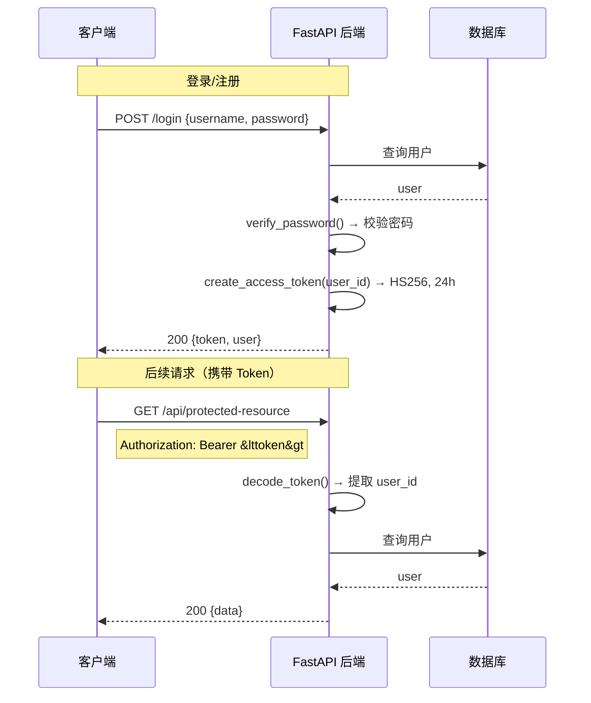

#### AI 聊天数据流（SSE 流式）

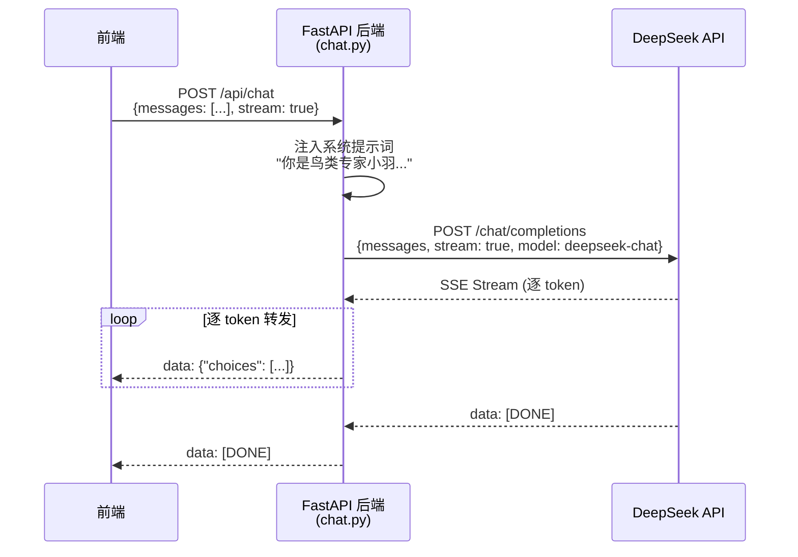

#### AI 识别数据流

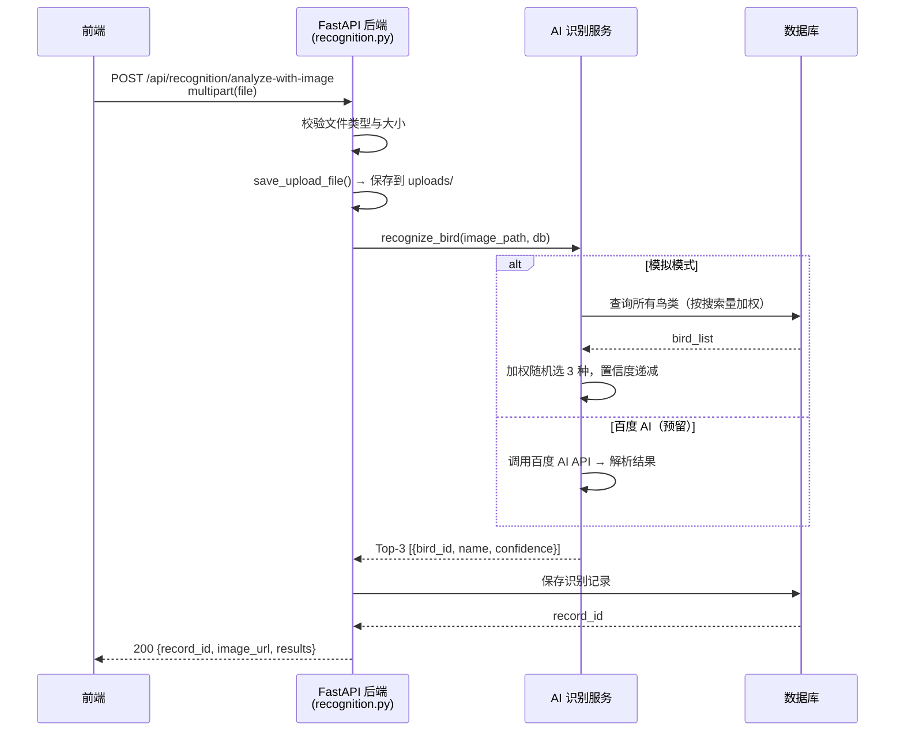

### 4.3 GUI 设计

| 页面 | 主要内容 | 交互要点 |
|------|---------|---------|
| **首页** | 轮播图、功能导航卡片、帖子列表 | 底部 TabBar 切换、下拉加载更多 |
| **登录/注册** | 表单输入、提交按钮 | 输入校验、错误提示、登录后回跳 |
| **上传识别** | 图片选择器、识别结果卡片 | 文件类型校验、上传进度、结果展示 |
| **百科** | 搜索框 + 鸟类卡片网格 | 实时搜索、分类筛选、点击进详情 |
| **排行榜** | 列表排名 | 搜索次数动态更新 |
| **AI 聊天** | 对话界面 | 消息气泡、WebSocket（规划） |
| **地图** | Leaflet 地图 + 标记点 | 点击标记查看详情 |
| **个人中心** | 资料卡片 + 帖子/识别记录标签 | Tab 切换、编辑弹窗 |

---

## 5. 安全设计

### 5.1 认证架构

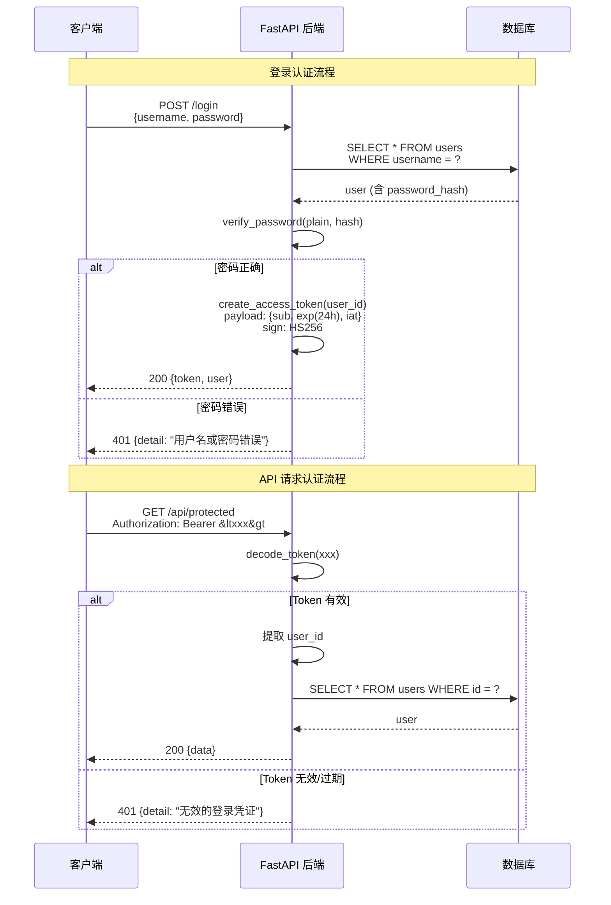

### 5.2 密码策略

- **算法**：PBKDF2_SHA256（passlib `pbkdf2_sha256`）
- **特点**：无需编译 C 扩展，跨平台兼容
- **存储**：仅存储哈希值，不存明文

### 5.3 JWT 配置

| 参数 | 值 |
|------|-----|
| 算法 | HS256 |
| Token 有效期 | 24 小时 |
| 密钥来源 | 环境变量 `JWT_SECRET_KEY` |
| 载荷内容 | `sub`（用户 ID）、`exp`（过期时间）、`iat`（签发时间） |

### 5.4 权限控制矩阵

| 接口 | 公开 | 需认证 | 资源所有者 |
|:----:|:----:|:------:|:---------:|
| 注册/登录 | ✓ | — | — |
| 百科查询/排行/搜索 | ✓ | — | — |
| 帖子列表/详情/评论列表 | ✓ | — | — |
| 上传识别/识别历史 | — | ✓ | ✓（仅本人） |
| 创建帖子/评论/点赞 | — | ✓ | — |
| 编辑/删除帖子 | — | ✓ | ✓（仅作者） |
| 个人中心 | — | ✓ | ✓（仅本人） |

### 5.5 输入校验

| 校验点 | 规则 |
|--------|------|
| 用户名 | 3~50 字符，唯一 |
| 密码 | 6~50 字符 |
| 帖子标题 | 1~200 字符 |
| 评论内容 | 1~500 字符 |
| 上传文件 | 扩展名白名单 `{jpg,jpeg,png,gif,webp}`，大小 ≤ 10MB |
| SQL 注入 | ORM 参数化查询 |

---

## 6. 部署设计

### 6.1 部署架构

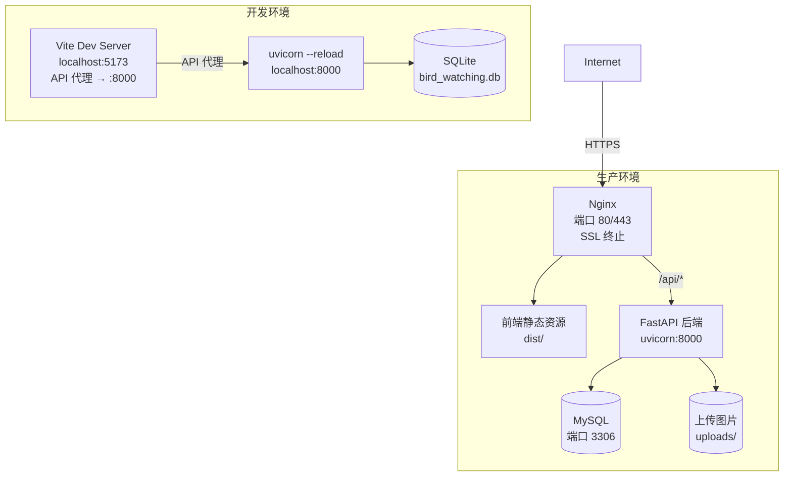

### 6.2 环境配置

| 配置项 | 环境变量 | 默认值（开发） |
|-------|---------|:------------:|
| 数据库主机 | `DB_HOST` | rm-uf64bg6a84ot516wu9o.mysql.rds.aliyuncs.com（阿里云 RDS） |
| 数据库端口 | `DB_PORT` | 3306 |
| 数据库名称 | `DB_NAME` | bird_watcing |
| 数据库用户 | `DB_USER` | Tongji_114514 |
| 数据库密码 | `DB_PASSWORD` | （必填） |
| JWT 密钥 | `JWT_SECRET_KEY` | development-secret |
| OSS Endpoint | `OSS_ENDPOINT` | oss-cn-shanghai.aliyuncs.com |
| OSS Bucket | `OSS_BUCKET` | birdwing-cloud |
| AI 聊天 API Key | `AI_API_KEY` | （必填，使用 DeepSeek） |
| AI 聊天模型 | `AI_MODEL` | deepseek-chat |
| AI 基础地址 | `AI_BASE_URL` | https://api.deepseek.com/v1 |
| AI 系统提示词 | `AI_SYSTEM_PROMPT` | 鸟类专家"小羽"角色设定 |
| 上传目录 | `UPLOAD_DIR` | ./uploads |
| 服务端口 | `PORT` | 8000 |
| 最大上传 | `MAX_UPLOAD_SIZE` | 10MB |

### 6.3 本地部署

```bash
# 后端
pip install -r requirements.txt
uvicorn app.main:app --reload        # http://localhost:8000

# 前端
cd frontend
npm install
npm run dev                          # http://localhost:5173
```

### 6.4 数据库自动降级机制

```
应用启动
  ├── 读取 database_url 配置
  ├── 尝试连接 MySQL
  │   ├── 成功 → 使用 MySQL（print "[OK] MySQL"）
  │   └── 失败 → 降级到 SQLite（print "[WARN]"）
  ├── Base.metadata.create_all()
  └── 应用就绪
```

---

