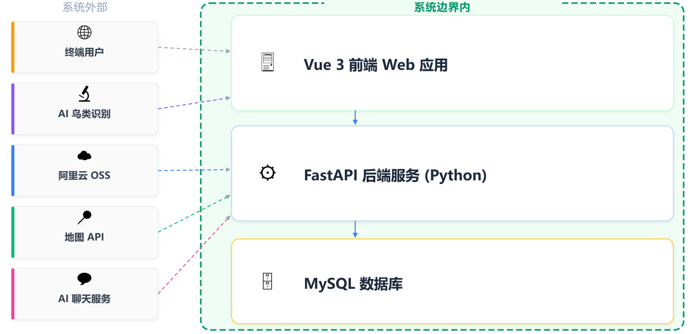
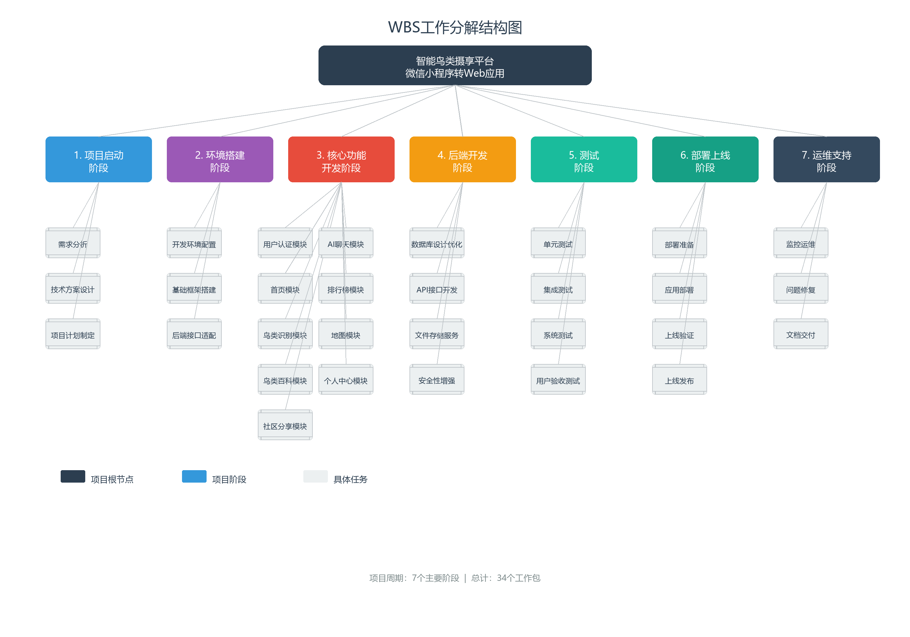
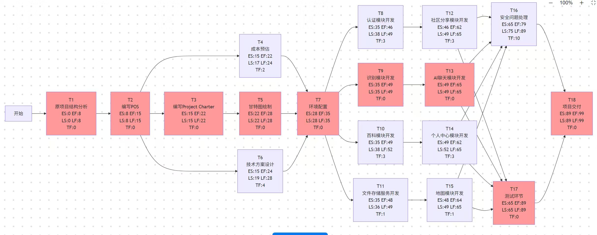
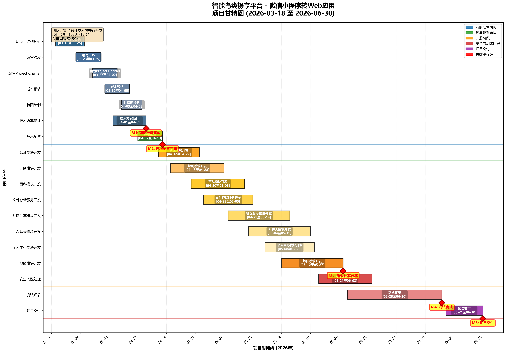
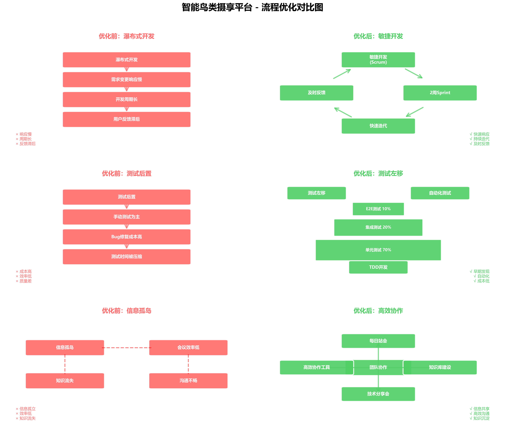
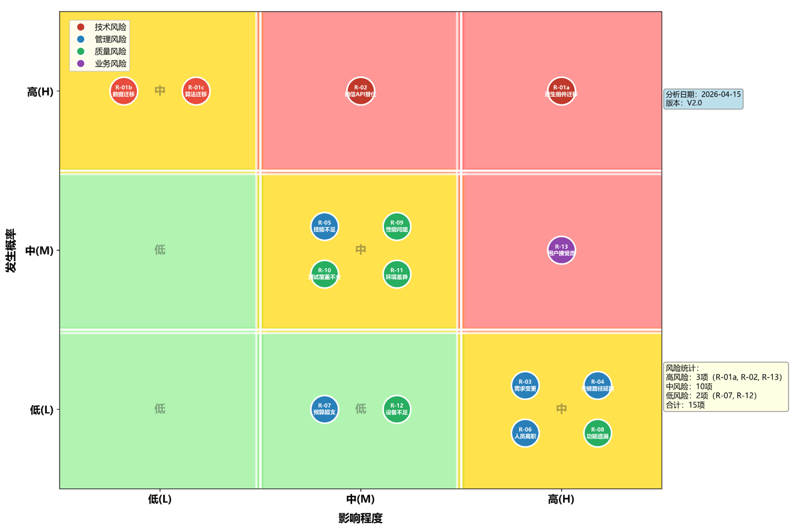

# 众翼云鉴：智能鸟类摄享平台 — 软件工程管理与软件工程经济分析报告

---

## 目录

1. [项目范围](#1-项目范围)
2. [项目计划](#2-项目计划)
3. [软件过程监控与控制](#3-软件过程监控与控制)
4. [软件过程改进（SPI）](#4-软件过程改进spi)
5. [项目风险管理](#5-项目风险管理)
6. [软件开发与运营成本估算](#6-软件开发与运营成本估算)
7. [定价与定价策略](#7-定价与定价策略)
8. [融资与筹资分析](#8-融资与筹资分析)
9. [财务评价与结果](#9-财务评价与结果)
10. [财务风险管理](#10-财务风险管理)
11. [结论](#11-结论)

---

## 1. 项目范围

### 1.1 项目概述

众翼云鉴是一个以鸟类识别与社区分享为核心的智能摄享平台。项目将原有微信小程序重构为 Web 应用，采用 Vue 3 + Vite 前端、FastAPI (Python) 后端及 MySQL 数据库的技术栈，并集成 AI 鸟类识别（通义千问 Qwen 多模态模型）、AI 智能聊天（DeepSeek）、云存储（阿里云 OSS）与地图 API 等外部服务。

**系统边界**：系统边界内包含 Vue 3 前端 Web 应用、FastAPI (Python) 后端服务、MySQL 数据库。系统边界外包括终端用户（浏览器端）、AI 鸟类识别服务（通义千问 Qwen 多模态模型）、阿里云 OSS 文件存储服务、地图 API 服务（高德/百度）、AI 聊天服务（DeepSeek）。




### 1.2 功能范围

#### 1.2.1 用户管理功能

- **用户注册**：新用户通过邮箱或手机号注册账户
- **用户登录**：支持密码登录与 Token 鉴权（JWT）
- **编辑个人资料**：用户可修改昵称、头像、个人简介等信息
- **修改密码 / 密码找回**：支持密码更新与重置
- **个人中心**：查看个人资料、识别历史、我的帖子

#### 1.2.2 鸟类识别功能

- **上传图片进行鸟类识别**：用户上传鸟类照片，调用 AI 识别服务返回识别结果
- **识别结果展示**：展示识别物种、置信度、相似鸟类等衍生计算结果
- **识别历史记录**：查看历史识别记录与详情

#### 1.2.3 社区互动功能

- **帖子发布与管理**：用户发布鸟类摄影帖子，支持编辑与删除
- **评论系统**：对帖子发表评论与回复，支持删除评论
- **点赞功能**：点赞/取消点赞帖子
- **帖子动态流**：首页推荐内容与动态信息流（含互动统计聚合）
- **排行榜**：基于识别数量与贡献的排名展示

#### 1.2.4 鸟类百科功能

- **百科浏览**：查看鸟类物种详细信息（外形、栖息地、保护等级等）
- **搜索与筛选**：按名称搜索、按分类筛选鸟类

#### 1.2.5 AI 聊天功能

- **AI 智能问答**：用户与 AI 助手进行自然语言对话
- **聊天记录**：查看历史聊天会话与消息记录

#### 1.2.6 观鸟点功能

- **观鸟点标注**：在地图上添加、编辑、删除观鸟点
- **地图浏览**：查看观鸟点分布与详情信息（集成地图 API）

### 1.3 非功能范围

#### 1.3.1 性能要求

- **首屏加载**：页面首屏加载时间 < 2s
- **图片识别响应**：AI 识别请求响应时间 < 5s（不含上传时间）
- **并发支持**：支持中等规模并发用户（约 100 同时在线）
- **文件上传**：支持图片文件上传，大小限制为 10MB

#### 1.3.2 安全要求

- **访问控制**：基于 JWT 的认证机制，支持用户角色权限管理
- **数据保护**：HTTPS 传输加密，密码加密存储
- **输入验证**：所有用户输入在服务端进行合法性校验

#### 1.3.3 可用性要求

- **响应式布局**：支持桌面端与移动端浏览器访问
- **用户友好**：直观的交互设计与清晰的错误提示

#### 1.3.4 可维护性要求

- **模块化设计**：前端组件化（Vue 3 Composition API），后端模块化（FastAPI 分层架构，Router → Service → Model）
- **编码规范**：统一代码风格，完善的注释与文档
- **版本控制**：使用 Git 进行版本管理

### 1.4 本期不涵盖范围（未来规划）

- **多语言支持**：当前仅支持中文界面，英文版规划在后续迭代
- **直播功能**：鸟类观测直播尚未纳入本期范围
- **移动端原生 App**：当前为 Web 应用，原生 App 规划在二期
- **离线识别**：AI 识别依赖云端服务，不支持离线识别
- **社交关系链**：关注、私信等社交功能未纳入本期

---

## 2. 项目计划

### 2.1 项目概述声明

| 项目属性 | 内容 |
|---------|------|
| 项目名称 | 众翼云鉴：智能鸟类摄享平台（微信小程序转 Web 应用重构） |
| 项目目标 | 将微信小程序重构为功能完整的 Web 应用，提供鸟类识别、社区分享、百科查询一体化服务 |
| 项目类型 | 新开发项目（New Development Project） |
| 技术栈 | Vue 3 + Vite（前端）、FastAPI / Python（后端）、MySQL（数据库） |
| 外部依赖 | AI 鸟类识别（通义千问 Qwen + 百度 AI 备用）、阿里云 OSS、高德/百度地图 API、AI 聊天（DeepSeek） |
| 项目规模 | 调整后功能点 224 FP（IFPUG），NESMA 估算 232 FP |
| 估算工作量 | 约 8.66 PM（GB/T 36964 口径）/ 约 19~28 人月（IFPUG Web 生产率口径） |
| 团队规模 | 4 人（全栈开发 × 4，分别兼任项目管理、产品设计、测试、运维） |
| 预计工期 | 15 周（2026-03-18 至 2026-06-16） |
| 关键路径长度 | 99 天（约 14.1 周） |

### 2.2 工作分解结构（WBS）



项目分解为 7 个一级阶段、27 个二级任务、120+个三级任务：

```
众翼云鉴：智能鸟类摄享平台 — Web 重构
├── 1. 项目启动阶段
│   ├── 1.1 需求分析
│   │   ├── 1.1.1 分析现有小程序功能清单
│   │   ├── 1.1.2 确定 Web 端功能范围
│   │   ├── 1.1.3 识别平台差异性需求
│   │   └── 1.1.4 编写需求规格说明书
│   ├── 1.2 技术方案设计
│   │   ├── 1.2.1 前端技术栈选型（Vue 3 + Vite）
│   │   ├── 1.2.2 响应式设计方案
│   │   ├── 1.2.3 API 接口适配方案
│   │   └── 1.2.4 架构设计文档编写
│   └── 1.3 项目计划制定
│       ├── 1.3.1 制定项目进度计划
│       ├── 1.3.2 资源分配计划
│       ├── 1.3.3 风险管理计划
│       └── 1.3.4 质量保证计划
├── 2. 环境搭建阶段
│   ├── 2.1 开发环境配置
│   │   ├── 2.1.1 前端开发环境搭建
│   │   ├── 2.1.2 后端开发环境配置
│   │   ├── 2.1.3 数据库环境准备
│   │   └── 2.1.4 版本控制系统配置
│   ├── 2.2 基础框架搭建
│   │   ├── 2.2.1 创建 Web 前端项目骨架
│   │   ├── 2.2.2 配置构建工具（Vite）
│   │   ├── 2.2.3 集成 UI 组件库（Element Plus / Ant Design Vue）
│   │   └── 2.2.4 配置路由系统
│   └── 2.3 后端接口适配
│       ├── 2.3.1 评估现有后端接口
│       ├── 2.3.2 设计 RESTful API 规范
│       ├── 2.3.3 配置跨域 CORS
│       └── 2.3.4 API 文档生成（Swagger）
├── 3. 核心功能开发阶段（4 人并行）
│   ├── 3.1 用户认证模块
│   │   ├── 3.1.1 用户注册功能（替代微信授权）
│   │   ├── 3.1.2 用户登录功能（邮箱/手机号）
│   │   ├── 3.1.3 密码找回功能
│   │   ├── 3.1.4 JWT 管理与权限控制
│   │   └── 3.1.5 用户权限控制
│   ├── 3.2 首页模块
│   │   ├── 3.2.1 首页布局设计
│   │   ├── 3.2.2 轮播图组件开发
│   │   ├── 3.2.3 推荐内容展示
│   │   ├── 3.2.4 快速导航功能
│   │   └── 3.2.5 响应式适配
│   ├── 3.3 鸟类识别模块
│   │   ├── 3.3.1 图片上传组件（替代 wx.chooseImage）
│   │   ├── 3.3.2 图片预览功能
│   │   ├── 3.3.3 AI 识别接口对接
│   │   ├── 3.3.4 识别结果展示（含置信度计算）
│   │   └── 3.3.5 识别历史记录
│   ├── 3.4 鸟类百科模块
│   │   ├── 3.4.1 百科列表页面
│   │   ├── 3.4.2 搜索功能实现
│   │   ├── 3.4.3 分类筛选功能
│   │   ├── 3.4.4 详情页面开发
│   │   └── 3.4.5 收藏功能
│   ├── 3.5 社区分享模块
│   │   ├── 3.5.1 照片上传功能（OSS 集成）
│   │   ├── 3.5.2 帖子发布功能
│   │   ├── 3.5.3 帖子列表展示（瀑布流）
│   │   ├── 3.5.4 点赞评论功能
│   │   └── 3.5.5 图片瀑布流布局
│   ├── 3.6 AI 聊天模块
│   │   ├── 3.6.1 聊天界面开发
│   │   ├── 3.6.2 WebSocket 连接（替代小程序实时通信）
│   │   ├── 3.6.3 消息发送接收
│   │   ├── 3.6.4 聊天历史记录
│   │   └── 3.6.5 AI 接口对接
│   ├── 3.7 排行榜模块
│   │   ├── 3.7.1 排行榜数据获取
│   │   ├── 3.7.2 排行榜展示页面
│   │   ├── 3.7.3 筛选条件实现
│   │   └── 3.7.4 用户排名详情
│   ├── 3.8 地图模块（观鸟点）
│   │   ├── 3.8.1 Web 地图 API 选型（高德/百度）
│   │   ├── 3.8.2 地图组件集成
│   │   ├── 3.8.3 位置标记功能
│   │   ├── 3.8.4 地理位置获取（HTML5 Geolocation）
│   │   └── 3.8.5 观鸟点展示
│   └── 3.9 个人中心模块
│       ├── 3.9.1 个人信息展示
│       ├── 3.9.2 个人资料编辑
│       ├── 3.9.3 我的发布管理
│       ├── 3.9.4 我的收藏管理
│       └── 3.9.5 设置功能
├── 4. 后端开发阶段
│   ├── 4.1 数据库设计优化
│   │   ├── 4.1.1 数据库表结构审查
│   │   ├── 4.1.2 索引优化
│   │   ├── 4.1.3 数据迁移脚本
│   │   └── 4.1.4 数据备份方案
│   ├── 4.2 API 接口开发
│   │   ├── 4.2.1 用户管理接口
│   │   ├── 4.2.2 鸟类识别接口
│   │   ├── 4.2.3 百科数据接口
│   │   ├── 4.2.4 社区互动接口
│   │   ├── 4.2.5 AI 聊天接口
│   │   ├── 4.2.6 排行榜接口
│   │   └── 4.2.7 地图数据接口
│   ├── 4.3 文件存储服务
│   │   ├── 4.3.1 OSS 配置优化
│   │   ├── 4.3.2 图片上传接口
│   │   ├── 4.3.3 图片压缩处理
│   │   └── 4.3.4 CDN 加速配置
│   └── 4.4 安全性增强
│       ├── 4.4.1 SQL 注入防护
│       ├── 4.4.2 XSS 攻击防护
│       ├── 4.4.3 CSRF 防护
│       ├── 4.4.4 接口限流
│       └── 4.4.5 敏感数据加密
├── 5. 测试阶段
│   ├── 5.1 单元测试
│   │   ├── 5.1.1 前端组件单元测试
│   │   ├── 5.1.2 后端接口单元测试
│   │   ├── 5.1.3 工具函数测试
│   │   └── 5.1.4 测试覆盖率达标（>80%）
│   ├── 5.2 集成测试
│   │   ├── 5.2.1 前后端接口联调
│   │   ├── 5.2.2 第三方服务集成测试
│   │   ├── 5.2.3 数据流测试
│   │   └── 5.2.4 异常场景测试
│   ├── 5.3 系统测试
│   │   ├── 5.3.1 功能测试
│   │   ├── 5.3.2 性能测试
│   │   ├── 5.3.3 兼容性测试（浏览器）
│   │   ├── 5.3.4 响应式测试（不同屏幕尺寸）
│   │   └── 5.3.5 安全测试
│   └── 5.4 用户验收测试（UAT）
│       ├── 5.4.1 UAT 测试计划
│       ├── 5.4.2 测试用例执行
│       ├── 5.4.3 问题收集整理
│       └── 5.4.4 修复验证
├── 6. 部署上线阶段
│   ├── 6.1 部署准备
│   │   ├── 6.1.1 生产环境配置
│   │   ├── 6.1.2 域名备案
│   │   ├── 6.1.3 SSL 证书配置
│   │   └── 6.1.4 服务器资源准备
│   ├── 6.2 应用部署
│   │   ├── 6.2.1 前端构建打包
│   │   ├── 6.2.2 前端部署（Nginx）
│   │   ├── 6.2.3 后端部署（Docker）
│   │   └── 6.2.4 数据库部署
│   ├── 6.3 上线验证
│   │   ├── 6.3.1 生产环境冒烟测试
│   │   ├── 6.3.2 性能监控配置
│   │   ├── 6.3.3 日志系统配置
│   │   └── 6.3.4 备份恢复验证
│   └── 6.4 上线发布
│       ├── 6.4.1 灰度发布
│       ├── 6.4.2 全量发布
│       ├── 6.4.3 发布公告
│       └── 6.4.4 用户引导
└── 7. 运维支持阶段
    ├── 7.1 监控运维
    │   ├── 7.1.1 应用性能监控
    │   ├── 7.1.2 服务器资源监控
    │   ├── 7.1.3 错误日志监控
    │   └── 7.1.4 用户行为分析
    ├── 7.2 问题修复
    │   ├── 7.2.1 Bug 修复
    │   ├── 7.2.2 性能优化
    │   ├── 7.2.3 用户反馈处理
    │   └── 7.2.4 紧急故障处理
    └── 7.3 文档交付
        ├── 7.3.1 用户使用手册
        ├── 7.3.2 系统运维手册
        ├── 7.3.3 API 接口文档
        └── 7.3.4 项目总结报告

**任务统计**：一级任务 7 个、二级任务 27 个、三级任务 120+ 个
```

### 2.3 项目进度与关键路径

#### 2.3.1 项目时间线（2026-03-18 至 2026-06-30，共 15 周）

**前期准备阶段（2026-03-18 ~ 2026-04-09）**

| 任务 | 起止日期 | 工期 | 负责人 |
|------|---------|:----:|------|
| 原项目结构分析 | 03-18 ~ 03-25 | 8天 | 全体成员 |
| 编写 POS | 03-23 ~ 03-29 | 7天 | 项目负责人 |
| 编写 Project Charter | 03-27 ~ 04-02 | 7天 | 项目负责人 |
| 成本预估 | 03-30 ~ 04-05 | 7天 | 项目负责人 |
| 甘特图绘制 | 04-03 ~ 04-08 | 6天 | 项目负责人 |
| 技术方案设计 | 04-01 ~ 04-09 | 9天 | 全体成员 |

**环境配置阶段（2026-04-07 ~ 2026-04-13）**

| 任务 | 起止日期 | 工期 | 负责人 |
|------|---------|:----:|------|
| 环境配置 | 04-07 ~ 04-13 | 7天 | 全体开发人员 |

**开发阶段（2026-04-12 ~ 2026-05-27）— 4 人并行**

| 任务 | 起止日期 | 工期 | 负责人 |
|------|---------|:----:|------|
| 认证模块开发 | 04-12 ~ 04-22 | 11天 | 开发人员 1 |
| 识别模块开发 | 04-15 ~ 04-28 | 14天 | 开发人员 2 |
| 百科模块开发 | 04-20 ~ 05-03 | 14天 | 开发人员 3 |
| 文件存储服务开发 | 04-23 ~ 05-05 | 13天 | 开发人员 4 |
| 社区分享模块开发 | 04-29 ~ 05-14 | 16天 | 开发人员 1 |
| AI 聊天模块开发 | 05-04 ~ 05-19 | 16天 | 开发人员 2 |
| 个人中心模块开发 | 05-08 ~ 05-20 | 13天 | 开发人员 3 |
| 地图模块开发 | 05-12 ~ 05-27 | 16天 | 开发人员 4 |

**安全与测试阶段（2026-05-21 ~ 2026-06-20）**

| 任务 | 起止日期 | 工期 | 负责人 |
|------|---------|:----:|------|
| 安全问题处理 | 05-21 ~ 06-03 | 14天 | 全体成员 |
| 测试环节 | 05-28 ~ 06-20 | 24天 | 全体成员 |

**项目交付阶段（2026-06-21 ~ 2026-06-30）**

| 任务 | 起止日期 | 工期 | 负责人 |
|------|---------|:----:|------|
| 项目交付 | 06-21 ~ 06-30 | 10天 | 全体成员 |

#### 2.3.2 CPM 关键路径分析



采用关键路径法（Critical Path Method）对 18 个任务节点进行正/逆向推算：

**关键路径（1 条，总长度 99 天 / 约 14.1 周）**：

```
A（原项目结构分析, 8天）
  → B（编写POS, 7天）
    → C（编写Project Charter, 7天）
      → E（甘特图绘制, 6天）
        → G（环境配置, 7天）
          → I（识别模块开发, 14天）
            → M（AI聊天模块开发, 16天）
              → Q（测试环节, 24天）
                → R（项目交付, 10天）
```

**关键任务节点**（共 9 个关键任务）：

| ID | 任务 | 工期 | ES | EF | LS | LF | TF |
|:--:|------|:---:|:--:|:--:|:--:|:--:|:--:|
| A | 原项目结构分析 | 8 | 0 | 8 | 0 | 8 | **0** |
| B | 编写POS | 7 | 8 | 15 | 8 | 15 | **0** |
| C | 编写Project Charter | 7 | 15 | 22 | 15 | 22 | **0** |
| E | 甘特图绘制 | 6 | 22 | 28 | 22 | 28 | **0** |
| G | 环境配置 | 7 | 28 | 35 | 28 | 35 | **0** |
| I | 识别模块开发 | 14 | 35 | 49 | 35 | 49 | **0** |
| M | AI聊天模块开发 | 16 | 49 | 65 | 49 | 65 | **0** |
| Q | 测试环节 | 24 | 65 | 89 | 65 | 89 | **0** |
| R | 项目交付 | 10 | 89 | 99 | 89 | 99 | **0** |

**非关键任务**（有浮动时间）：

| ID | 任务 | 工期 | ES | EF | LS | LF | TF | 管理建议 |
|:--:|------|:---:|:--:|:--:|:--:|:--:|:--:|---------|
| D | 成本预估 | 7 | 15 | 22 | 17 | 24 | 2 | 可延后 2 天 |
| F | 技术方案设计 | 9 | 15 | 24 | 19 | 28 | 4 | 可延后 4 天 |
| H | 认证模块开发 | 11 | 35 | 46 | 38 | 49 | 3 | 可延后 3 天 |
| J | 百科模块开发 | 14 | 35 | 49 | 38 | 52 | 3 | 可延后 3 天 |
| K | 文件存储服务开发 | 13 | 35 | 48 | 36 | 49 | 1 | 可延后 1 天 |
| L | 社区分享模块开发 | 16 | 46 | 62 | 49 | 65 | 3 | 可延后 3 天 |
| N | 个人中心模块开发 | 13 | 49 | 62 | 52 | 65 | 3 | 可延后 3 天 |
| O | 地图模块开发 | 16 | 48 | 64 | 49 | 65 | 1 | 可延后 1 天 |
| P | 安全问题处理 | 14 | 65 | 79 | 75 | 89 | 10 | 可延后 10 天 |

**关键路径管理重点**：
- **Q - 测试环节（24 天）**：工期最长，直接影响最终交付日期
- **M - AI聊天模块开发（16 天）**：紧随识别的下一环，控制住此节点才能确保测试如期启动
- **I - 识别模块开发（14 天）**：控制所有并行开发的前置条件，延迟将扩散到 M、Q
- **R - 项目交付（10 天）**：最后一道关口，交付准备与部署验收无浮动余量
- 关键任务延迟需立即启动应急预案

---

## 3. 软件过程监控与控制

### 3.1 项目管理工具

| 工具 | 用途 | 说明 |
|------|------|------|
| Git / GitHub / GitLab | 版本控制与代码托管 | 管理代码变更历史与版本回滚；支持分支策略（feature branch + main + hotfix） |
| GitHub Projects / Jira / Trello | 看板与任务管理 | 任务分配、Sprint 规划、进度可视化管理 |
| 企业微信 / 飞书 / Slack | 团队沟通 | 日常站会沟通、问题反馈与信息同步 |
| Confluence / 飞书文档 | 文档协作 | 知识库管理、文档沉淀 |
| Swagger / Postman | API 文档与测试 | 接口文档自动生成与联调测试 |

### 3.2 开发方法论

#### 3.2.1 Scrum 敏捷框架

- **Sprint 周期**：2 周一迭代
- **每日站会**：同步进度、识别阻塞
- **Sprint Review**：迭代评审会议，展示完成的功能
- **Sprint Retrospective**：迭代回顾，持续改进

#### 3.2.2 版本控制策略

- **分支策略**：`main` 为主干分支，`feature/*` 为功能分支，`hotfix/*` 为紧急修复分支
- **提交规范**：遵循 Conventional Commits（`feat:` / `fix:` / `refactor:` 等）
- **合并要求**：功能分支开发完成后通过 PR 合并至 main，需通过 Code Review

### 3.3 甘特图与里程碑节点

#### 3.3.1 甘特图

项目时间跨度：2026-03-18 至 2026-06-30（共 15 周）



#### 3.3.2 关键里程碑

| 里程碑 | 日期 | 交付物 |
|--------|------|--------|
| M1：前期准备完成 | 2026-04-09 | POS、Project Charter、技术方案、成本预估、甘特图 |
| M2：环境配置完成 | 2026-04-13 | 开发环境、基础框架、Git 仓库 |
| M3：核心功能开发完成 | 2026-05-27 | 所有 9 个功能模块代码（认证/识别/百科/社区/AI 聊天/排行榜/地图/个人中心/文件存储） |
| M4：安全与测试完成 | 2026-06-20 | 测试报告、Bug 修复清单、安全审计报告 |
| M5：项目交付 | 2026-06-30 | 生产环境运行系统、用户手册、运维手册、API 文档 |

### 3.4 挣值分析（EVA）

#### 3.4.1 课程预算口径

根据课程实验三的设定，项目管理采用 **5000 元（BAC）** 作为课程执行预算。

#### 3.4.2 计划价值（PV）按阶段分配

| 工程阶段 | 占比 | PV（元） | 累计 PV（元） |
|---------|:----:|---------:|-------------:|
| 需求分析 | 14.25% | 712.50 | 712.50 |
| 架构与设计 | 12.38% | 619.00 | 1,331.50 |
| 代码构建 | 39.56% | 1,978.00 | 3,309.50 |
| 系统测试 | 23.01% | 1,150.50 | 4,460.00 |
| 实施交付 | 10.80% | 540.00 | 5,000.00 |

#### 3.4.3 EVA 评价指标

| 指标 | 公式 | 说明 |
|------|------|------|
| BAC（预算总计） | — | 5,000 元 |
| PV（计划价值） | 计划工作量 × 预算单价 | 各阶段累计计划值 |
| EV（挣值） | 实际完成工作量 × 预算单价 | 已完成工作的计划价值 |
| AC（实际成本） | — | 实际支出 |
| SV（进度偏差） | EV - PV | >0 表示进度超前 |
| CV（成本偏差） | EV - AC | >0 表示成本节省 |
| SPI（进度绩效） | EV / PV | >1 表示进度超前 |
| CPI（成本绩效） | EV / AC | >1 表示成本节省 |

---

## 4. 软件过程改进（SPI）

为提升开发效率、软件质量与团队协作水平，项目从开发流程、测试流程、项目管理、技术架构与团队协作五个方面制定系统化的过程改进方案。



### 4.1 开发流程优化

#### 4.1.1 敏捷开发流程引入

**现状问题**：传统瀑布式开发响应慢，需求变更反馈滞后，团队协作效率低。

**优化方案**：采用 Scrum 敏捷开发框架

| Sprint | 周期 | 内容 |
|--------|------|------|
| Sprint 1-2 | Week 1-4 | 前期准备 + 环境配置 |
| Sprint 3-4 | Week 5-8 | 核心功能模块（认证、识别、百科） |
| Sprint 5-6 | Week 9-12 | 高级功能（社区分享、AI 聊天、地图） |
| Sprint 7 | Week 13-14 | 安全处理与测试 |
| Sprint 8 | Week 15 | 项目交付 |

**具体实施**：
- Sprint 周期 2 周，含计划会议、每日站会、评审会议、回顾会议
- 每日站会（15 分钟）：昨天完成、今天计划、遇到的问题
- 每周进度会议 + 每两周技术分享会
- 每个 Sprint 结束交付可演示版本

**优化效果**：快速响应需求变更，每 2 周可交付可演示版本，及早发现问题降低返工成本。

#### 4.1.2 持续集成/持续部署（CI/CD）

**现状问题**：手动构建部署耗时易错，代码集成频率低冲突多。

**优化方案**：建立自动化 CI/CD 流水线

```
代码提交 → 自动构建 → 单元测试 → 代码质量检查 → 构建镜像 → 部署测试环境 → 自动化测试 → 部署生产环境
```

**前端 CI/CD**（GitHub Actions）：
```yaml
on: push to main/develop
steps: Setup Node.js → npm ci → npm run lint → npm run test:unit → npm run build → deploy
```

**后端 CI/CD**（GitHub Actions）：
```yaml
on: push to main/develop
steps: Setup Python → pip install -r requirements.txt → pytest → Docker build → Docker push → deploy
```

**优化效果**：
- 减少手动部署时间，提升自动化测试覆盖率
- 代码提交后自动部署到测试环境，快速回滚降低发布风险

#### 4.1.3 代码审查流程

- 所有功能分支通过 Pull Request 合入 main，需通过 Code Review
- 遵循 Conventional Commits 提交规范（`feat:` / `fix:` / `refactor:` 等）
- 实施结对编程与同行评审

### 4.2 测试流程优化

#### 4.2.1 测试左移策略

**现状问题**：测试在开发后期才介入，Bug 修复成本高，测试时间被压缩。

**优化方案**：测试前置，开发测试并行

**测试金字塔模型**：
```
           /\
          /  \   E2E 测试 (10%)
         /____\
        /      \  集成测试 (20%)
       /________\
      /          \  单元测试 (70%)
     /____________\
```

**各阶段测试介入**：
- **需求阶段**：测试人员参与需求评审，编写测试计划和测试用例
- **开发阶段**：开发人员编写单元测试（TDD），测试人员准备测试数据
- **测试阶段**：接口开发完成即进行接口测试

**测试框架**：
- 前端单元测试：Jest + Vue Test Utils
- 后端单元测试：JUnit + Mockito
- API 集成测试：Postman + Newman / RestAssured
- E2E 测试：Cypress / Playwright

**覆盖率目标**：代码测试覆盖率 > 80%

#### 4.2.2 自动化测试体系建设

**分层自动化执行策略**：
- 每次代码提交：运行单元测试
- 每日构建：运行集成测试
- 每周构建：运行完整 E2E 测试

**优化效果**：Bug 发现时间提前，测试周期缩短，回归测试效率大幅提升。

### 4.3 项目管理流程优化

#### 4.3.1 需求管理优化

**标准化需求管理流程**：

```
需求来源 → 需求池 → 需求评审 → 优先级排序 → Sprint Backlog → 开发实现
```

**需求变更控制**：
1. 提交变更申请
2. 评估影响范围（时间、成本、质量）
3. 变更评审会议
4. 批准后更新需求文档和计划

#### 4.3.2 沟通协作机制

| 沟通方式 | 频率 | 形式 | 目的 |
|---------|------|------|------|
| 每日站会 | 每天 09:30 | 站立会议 15 分钟 | 进度同步、问题识别 |
| 周会 | 每周五下午 | 1 小时会议 | 进度回顾、下周计划、风险识别 |
| Sprint 评审 | 每 2 周 | 演示 + 讨论 | 展示完成功能、收集反馈 |
| 技术分享会 | 每 2 周 | 分享 + 交流 | 知识共享、团队成长 |

### 4.4 知识管理体系

**知识库内容**：

| 类别 | 内容 | 工具 |
|------|------|------|
| 项目文档 | 需求文档、设计文档、接口文档 | Confluence / 飞书文档 |
| 技术文档 | 架构设计、技术选型、最佳实践 | Wiki / GitBook |
| 操作手册 | 部署手册、运维手册、故障处理 | 项目 docs/ 目录 |
| API 文档 | 接口定义、请求/响应示例 | Swagger / Postman |

### 4.5 预期改进效果

| 指标 | 改进前 | 改进后预期 |
|------|:-----:|:---------:|
| 开发效率 | 基线 | 提升 40% |
| 代码质量 | 基线 | 提升 30% |
| Bug 数量 | 基线 | 减少 50% |
| 部署时间 | 手动部署 ~2 小时 | 自动化 < 5 分钟 |
| 团队满意度 | 基线 | 提升至 80% 以上 |

### 4.6 后续改进方向

1. **完善质量度量体系**：建立自动化代码质量检查，实施缺陷预防机制
2. **优化项目监控机制**：实施实时进度跟踪工具，建立风险预警系统
3. **建立组织过程资产**：形成标准化过程模板库，构建最佳实践知识库

---

## 5. 项目风险管理

### 5.1 风险管理概述

#### 5.1.1 风险管理目标
- 识别项目中可能出现的风险
- 评估风险发生的概率和影响程度
- 制定风险应对策略
- 监控风险并及时调整应对措施

#### 5.1.2 风险评估标准

**概率等级**：
- 高（H）：发生概率 > 60%
- 中（M）：发生概率 30%~60%
- 低（L）：发生概率 < 30%

**影响等级**：
- 高（H）：严重影响项目进度、质量或成本
- 中（M）：中等程度影响，可通过调整解决
- 低（L）：轻微影响，不影响整体目标

**风险等级矩阵**：
```
        影响程度
概率    低(L)   中(M)   高(H)
高(H)    M       H       H
中(M)    L       M       H
低(L)    L       L       M
```

### 5.2 风险识别与应对



#### 5.2.1 技术风险

**R-01：uni-app 组件无法直接迁移到 Web，需要重写**

| 属性 | 内容 |
|------|------|
| 概率/影响/等级 | 高 / 高 / **高** |
| 预防 | 提前进行技术调研，选择合适的 Web 框架（Vue 3 + Vite） |
| 缓解 | 建立组件映射表，逐个评估迁移难度 |
| 应急 | 预留 20% 的开发时间用于组件重构 |
| 责任人 | 项目负责人 |

**R-02：微信小程序 API（如 wx.chooseImage）在 Web 端无对应实现**

| 属性 | 内容 |
|------|------|
| 概率/影响/等级 | 高 / 中 / **高** |
| 预防 | 使用 HTML5 标准 API 替代（File API、Geolocation API） |
| 缓解 | 封装统一的 API 适配层，隔离平台差异 |
| 应急 | 使用第三方库（如 cropperjs、leaflet） |
| 责任人 | 开发团队 |

#### 5.2.2 项目管理风险

**R-03：需求分析不充分，后期频繁变更**

| 属性 | 内容 |
|------|------|
| 概率/影响/等级 | 低 / 高 / **中** |
| 预防 | 需求评审会议，所有干系人确认签字 |
| 缓解 | 实施变更控制流程，评估影响后再决定 |
| 应急 | 冻结需求，延期到下一版本 |
| 责任人 | 项目负责人 |

**R-04：关键路径任务延期导致整体延期**

| 属性 | 内容 |
|------|------|
| 概率/影响/等级 | 低 / 高 / **中** |
| 预防 | 每周进度检查，提前识别延期风险 |
| 缓解 | 增加资源投入，加班或增派人手 |
| 应急 | 调整项目范围，砍掉非核心功能 |
| 责任人 | 项目负责人 |

**R-05：开发人员技能不足，学习曲线长**

| 属性 | 内容 |
|------|------|
| 概率/影响/等级 | 中 / 中 / **中** |
| 预防 | 项目启动前进行技术培训 |
| 缓解 | 安排技术专家进行代码审查和指导 |
| 应急 | 外包部分开发任务 |
| 责任人 | 项目负责人 |

**R-06：核心开发人员离职或请假**

| 属性 | 内容 |
|------|------|
| 概率/影响/等级 | 低 / 高 / **中** |
| 预防 | 代码文档化，知识共享会议 |
| 缓解 | 交叉培训，确保至少 2 人熟悉每个模块 |
| 应急 | 紧急招聘或外包 |
| 责任人 | 项目负责人 |

**R-07：预算超支，无法购买必要工具或服务**

| 属性 | 内容 |
|------|------|
| 概率/影响/等级 | 低 / 中 / **低** |
| 预防 | 制定详细预算计划，预留 10% 应急资金 |
| 缓解 | 优先保证核心功能开发 |
| 应急 | 使用开源替代方案 |
| 责任人 | 项目负责人 |

#### 5.2.3 质量风险

**R-08：功能迁移不完整，遗漏关键功能**

| 属性 | 内容 |
|------|------|
| 概率/影响/等级 | 低 / 高 / **中** |
| 预防 | 制作功能对照表，逐项检查 |
| 缓解 | 用户验收测试阶段收集反馈 |
| 应急 | 快速迭代补充遗漏功能 |
| 责任人 | 项目负责人 |

**R-09：性能问题，页面加载慢**

| 属性 | 内容 |
|------|------|
| 概率/影响/等级 | 中 / 中 / **中** |
| 预防 | 性能测试，设定性能指标（首屏 < 2s） |
| 缓解 | 代码优化、懒加载、CDN 加速 |
| 应急 | 降级方案，减少动画效果 |
| 责任人 | 项目负责人 |

**R-10：测试用例覆盖不全，遗漏 Bug**

| 属性 | 内容 |
|------|------|
| 概率/影响/等级 | 中 / 中 / **中** |
| 预防 | 基于需求编写测试用例，评审确认 |
| 缓解 | 探索性测试补充 |
| 应急 | 生产环境监控，快速响应 |
| 责任人 | 项目负责人 |

**R-11：测试环境与生产环境差异大**

| 属性 | 内容 |
|------|------|
| 概率/影响/等级 | 中 / 中 / **中** |
| 预防 | 测试环境配置与生产环境一致 |
| 缓解 | 预发布环境验证 |
| 应急 | 生产环境灰度发布 |
| 责任人 | 项目负责人 |

**R-12：兼容性测试设备不足**

| 属性 | 内容 |
|------|------|
| 概率/影响/等级 | 低 / 中 / **低** |
| 预防 | 使用 BrowserStack 等云测试平台 |
| 缓解 | 重点测试主流浏览器和设备 |
| 应急 | 用户反馈后快速修复 |
| 责任人 | 项目负责人 |

#### 5.2.4 业务风险

**R-13：用户不愿从小程序迁移到 Web 端**

| 属性 | 内容 |
|------|------|
| 概率/影响/等级 | 中 / 高 / **高** |
| 预防 | 提供 Web 端独有功能（大屏体验、更多数据展示） |
| 缓解 | 小程序和 Web 端数据互通，用户可自由切换 |
| 应急 | 保留小程序版本，双端运营 |
| 责任人 | 项目负责人 |

### 5.3 风险汇总

| 风险ID | 风险描述 | 类别 | 概率 | 影响 | 等级 |
|:------:|---------|:---:|:----:|:----:|:----:|
| R-01 | uni-app 组件迁移困难 | 技术 | H | H | **高** |
| R-02 | 微信 API 替代方案 | 技术 | H | M | **高** |
| R-03 | 需求频繁变更 | 管理 | L | H | **中** |
| R-04 | 关键路径延期 | 管理 | L | H | **中** |
| R-05 | 技能不足 | 管理 | M | M | **中** |
| R-06 | 人员离职 | 管理 | L | H | **中** |
| R-07 | 预算超支 | 管理 | L | M | **低** |
| R-08 | 功能遗漏 | 质量 | L | H | **中** |
| R-09 | 性能问题 | 质量 | M | M | **中** |
| R-10 | 测试覆盖不全 | 质量 | M | M | **中** |
| R-11 | 环境差异 | 质量 | M | M | **中** |
| R-12 | 测试设备不足 | 质量 | L | M | **低** |
| R-13 | 用户接受度 | 业务 | M | H | **高** |

**风险统计**：总风险 13 项，其中高风险 3 项（23.1%）、中风险 8 项（61.5%）、低风险 2 项（15.4%）

### 5.4 风险监控与报告

**监控频率**：
- 高风险：每周检查
- 中风险：每两周检查
- 低风险：每月检查

**监控方式**：项目周会讨论风险状态，风险登记册实时更新，关键指标仪表板监控

**风险报告流程**：
1. 风险识别 → 2. 风险评估 → 3. 风险应对 → 4. 风险跟踪 → 5. 风险关闭

**升级机制**：
- 升级条件：高风险且无有效应对措施 / 风险已发生且影响严重 / 应对措施失效
- 升级路径：项目负责人 → 管理层

### 5.5 应急预案

| 场景 | 触发条件 | 应急措施 |
|------|---------|---------|
| 项目延期 | 关键路径任务延期超过 3 天 | 紧急会议分析原因 → 调整资源 → 必要时砍非核心功能 → 通报干系人 |
| 重大 Bug | 严重影响核心功能的 Bug | 停止相关开发 → 技术攻关 → 24 小时内修复 → 代码审查 → 更新规范 |
| 人员流失 | 核心开发人员离职 | 启动知识转移 → 安排接手人员 → 评估影响 → 启动招聘 → 考虑外包 |

---

## 6. 软件开发与运营成本估算

### 6.1 功能点分析（实验二/三数据）

本项目采用 IFPUG 详细法为主方法、NESMA 估算法为验证方法的双口径估算体系。

#### 6.1.1 数据功能点（ILF/EIF）

| 类型 | 逻辑文件 | DET | RET | 复杂度 | 权重 |
|:----:|---------|:---:|:---:|:------:|:----:|
| ILF | 用户信息（User） | 14 | 2 | 低 | 7 |
| ILF | 鸟类百科（Bird Encyclopedia） | 16 | 2 | 低 | 7 |
| ILF | 识别记录（Recognition Records） | 10 | 1 | 低 | 7 |
| ILF | 社区帖子（Community Posts） | 13 | 1 | 低 | 7 |
| ILF | 评论数据（Comments） | 8 | 1 | 低 | 7 |
| ILF | 点赞数据（Likes） | 6 | 1 | 低 | 7 |
| ILF | 收藏数据（Favorites） | 7 | 1 | 低 | 7 |
| ILF | 聊天记录（Chat History） | 9 | 1 | 低 | 7 |
| ILF | 观鸟点（Bird Watching Spots） | 11 | 1 | 低 | 7 |
| EIF | AI 鸟类识别服务 | 6 | 1 | 低 | 5 |
| EIF | 文件存储服务（OSS） | 5 | 1 | 低 | 5 |
| EIF | 地图 API 服务 | 8 | 1 | 低 | 5 |

**数据功能点合计**：9 × 7（ILF）+ 3 × 5（EIF）= 63 + 15 = **78 FP**

#### 6.1.2 事务功能点（EI/EO/EQ）

**外部输入（EI）**：18 个，合计 **63 FP**

| 复杂度 | 数量 | 单价 | 小计 |
|:------:|:----:|:----:|:----:|
| 低 | 9 | 3 FP | 27 |
| 平均 | 9 | 4 FP | 36 |

**外部输出（EO）**：4 个，合计 **20 FP**（均为平均复杂度 × 5 FP）

**外部查询（EQ）**：14 个，合计 **48 FP**

| 复杂度 | 数量 | 单价 | 小计 |
|:------:|:----:|:----:|:----:|
| 低 | 8 | 3 FP | 24 |
| 平均 | 6 | 4 FP | 24 |

#### 6.1.3 未调整功能点（UFP）

| 组件类型 | 功能点 |
|---------|:------:|
| ILF（内部逻辑文件） | 63 |
| EIF（外部接口文件） | 21 |
| EI（外部输入） | 63 |
| EO（外部输出） | 20 |
| EQ（外部查询） | 48 |
| **UFP 合计** | **215 FP** |

#### 6.1.4 调整因子（VAF）

基于 14 个通用系统特征评分（GSC）：

| ID | 通用系统特征 | 权重 |
|:--:|-------------|:----:|
| 1 | 数据通信（Data Communications） | 4 |
| 2 | 分布式数据处理（Distributed Data Processing） | 3 |
| 3 | 性能（Performance） | 3 |
| 4 | 高负载配置（Heavily Used Configuration） | 2 |
| 5 | 事务速率（Transaction Rate） | 3 |
| 6 | 在线数据输入（On-Line Data Entry） | 4 |
| 7 | 最终用户效率（End-User Efficiency） | 3 |
| 8 | 在线更新（On-Line Update） | 3 |
| 9 | 复杂处理（Complex Processing） | 4 |
| 10 | 可重用性（Reusability） | 2 |
| 11 | 安装便捷性（Installation Ease） | 2 |
| 12 | 操作便捷性（Operational Ease） | 2 |
| 13 | 多站点（Multiple Sites） | 1 |
| 14 | 易变更性（Facilitate Change） | 3 |

**TDI（总影响度）** = 4+3+3+2+3+4+3+3+4+2+2+2+1+3 = **39**

**VAF（调整因子）** = 0.65 + 0.01 × 39 = **1.04**

#### 6.1.5 调整后功能点（AFP）

**AFP = UFP × VAF = 215 × 1.04 = 223.6 ≈ 224 FP**

#### 6.1.6 NESMA 交叉验证

| 方法 | UFP | 偏差 |
|------|:---:|:----:|
| IFPUG 详细法（主方法） | **215 FP** | — 基准 |
| NESMA 估算法 | **232 FP** | +7.9% |
| NESMA 指示法 | **360 FP** | +67.4% |

NESMA 估算法偏差 +7.9%（< 10%），IFPUG 结果通过验证。

### 6.2 GB/T 36964 成本估算

基于国家标准 GB/T 36964，采用 NESMA 估算法规模 232 FP 进行测算。

**基础参数**：

| 参数 | 数值 | 来源 |
|------|:----:|------|
| 功能点规模（NESMA） | 232 FP | 实验二 |
| 生产率基准（P50） | 6.72 人时/FP | 2025 中国软件行业基准数据 |
| 人月折算 | 180 人时/PM（22.5天 × 8小时） | GB/T 36964 |
| 上海地区人月费率 | 32,388.62 元/PM | 行业基准 × 地区系数 |

**工作量与成本计算**：

$$总人时 = 232 \times 6.72 = 1559.04 \text{ 人时}$$

$$总人月 = \frac{1559.04}{180} = 8.661 \text{ PM}$$

$$总成本 = 8.661 \times 32388.62 \approx 280528.67 \text{ 元}$$

**结论**：项目在标准软件工程人力口径下的研发费用约为 **28.05 万元**。

### 6.3 按工程活动成本拆解

结合行业平均工作量分布进行拆解：

| 工程阶段 | 占比 | 人时（约） | 成本（元，约） |
|---------|:----:|:---------:|:-------------:|
| 需求分析 | 14.25% | 222 | 39,975 |
| 架构与设计 | 12.38% | 193 | 34,734 |
| 代码构建 | 39.56% | 617 | 110,975 |
| 系统测试 | 23.01% | 358 | 64,554 |
| 实施交付 | 10.80% | 169 | 30,290 |
| **合计** | **100.00%** | **1,559** | **280,529** |

### 6.4 IFPUG 交叉验证

采用 IFPUG 调整后规模 224 FP，按规格化系数修正生产率：

$$P_{IFPUG} = 6.72 \times 1.06 = 7.1232 \text{ 人时/FP}$$

$$总人时 = 224 \times 7.1232 = 1595.60 \text{ 人时}$$

$$总成本 = \frac{1595.60}{180} \times 32388.62 \approx 287106.55 \text{ 元}$$

**偏差率**：

$$\text{偏差率} = \frac{287106.55 - 280528.67}{280528.67} \times 100\% \approx 2.35\%$$

偏差小于 10%，GB/T 36964 主估算结果可信。

### 6.5 运营成本估算

按年度运营口径估算云服务与维护成本：

| 成本项目 | 月均（元） | 年化（元） | 说明 |
|---------|:---------:|:---------:|------|
| 云服务器（ECS） | 500 | 6,000 | 单台云服务器，中等配置 |
| OSS 存储 | 200 | 2,400 | 图片与静态资源存储 |
| AI 识别 API 调用 | 800 | 9,600 | 月度识别调用估算 10,000 次 |
| 地图 API 调用 | 100 | 1,200 | 月度地图服务调用 |
| 数据库（RDS） | 300 | 3,600 | MySQL 托管实例 |
| 域名与 CDN | 150 | 1,800 | CDN 加速静态资源 |
| 运维人工（兼职） | 2,000 | 24,000 | 兼职运维工程师 |
| **合计** | **4,050** | **48,600** | 年运营成本 |

### 6.6 成本估算汇总

| 口径 | 总成本（元） | 用途 |
|------|:----------:|------|
| GB/T 36964 标准人力成本 | 280,528.67 | 商业化研发成本参考 |
| IFPUG 交叉验证成本 | 287,106.55 | 偏差率 2.35%，一致性良好 |
| **年均运营成本** | **48,600** | 系统上线后年度维护费用 |
| **课程执行预算（BAC）** | **5,000** | 教学环境与资源开销 |

---

## 7. 定价与定价策略


### 7.1 定价目标

1. **市场渗透**：以竞争性定价快速获取鸟类爱好者和摄影爱好者用户群
2. **价值体现**：反映平台在 AI 识别、社区互动和百科数据方面的技术优势
3. **可持续盈利**：覆盖开发成本（约 28 万元）与年度运营成本（约 4.86 万元）
4. **用户分层**：为不同规模用户群体设计差异化方案（免费用户 / 专业用户）

### 7.2 定价模型

采用混合定价策略，结合三种模型：

| 定价模型 | 计费方式 | 适用场景 |
|---------|---------|---------|
| **Freemium（免费增值）** | 基础功能免费 + 增值功能付费 | 吸引普通鸟类爱好者，引导转化为付费用户 |
| **订阅制（SaaS）** | 月度/年度会员费 | 专业用户、观鸟摄影爱好者 |
| **按量计费** | AI 识别按次计费、存储按量计费 | 高频使用场景下的弹性计费 |

### 7.3 详细定价方案

#### 7.3.1 用户分层方案

| 层级 | 月费（元） | 年费（元） | 功能权益 |
|:----:|:---------:|:---------:|---------|
| **免费版** | 0 | 0 | 基础鸟类识别（每日 5 次）、浏览百科、浏览社区帖子、基础地图浏览 |
| **专业版** | 19.9 | 199（≈ 16.6/月） | 无限识别、高清原图上传、去广告、识别历史高级统计、优先新功能体验 |
| **摄影版** | 39.9 | 399（≈ 33.3/月） | 专业版全部功能 + 无限云存储空间、图片版权保护、数字水印、高级数据分析 |
| **教育/机构版** | 定制 | 定制 | 批量账号管理、API 接入、定制识别模型、专属技术支持 |

#### 7.3.2 AI 识别按量计费（面向开发者/机构）

| 月调用量 | 单价（元/次） | 说明 |
|:--------:|:------------:|------|
| 0~1,000 | 0.50 | 入门级，适合个人开发者 |
| 1,000~10,000 | 0.30 | 专业级 |
| 10,000+ | 0.15 | 企业级，提供专属通道 |

### 7.4 差异化策略

1. **新用户优惠**：首月专业版 1 元体验
2. **教育折扣**：高校师生凭 edu 邮箱享受专业版 5 折优惠
3. **长期激励**：连续包年用户享受年费 8 折优惠 + 赠送 1 个月会员
4. **推荐奖励**：推荐新用户注册，双方各获得 7 天专业版体验

### 7.5 基于成本的定价分析

| 服务项目 | 单位成本 | 建议售价 | 毛利率 |
|---------|:-------:|:--------:|:-----:|
| AI 识别单次调用（含云成本） | 0.08 元 | 0.30~0.50 元 | 73~84% |
| 图片存储（每 GB/月） | 0.12 元 | 0.50 元（按套餐） | 76% |
| 专业版月费（人均服务器成本） | 2 元 | 19.9 元 | 90% |

注：运营成本按服务单元分摊，整体毛利率目标维持在 70~90%。

### 7.6 竞争对标

与市场上同类产品（如鸟类识别 App、自然观察社区）相比：

- **功能丰富度**显著领先：集成识别 + 社区 + 百科 + 地图四位一体
- **定位差异化**：国内鸟类识别+社区垂直领域，尚无头部 Web 平台
- **定价竞争力**：低于国外同类产品（如 Merlin Bird ID、eBird 增值服务）

**盈亏平衡点**：约 420 名专业版年费用户（420 × 199 ≈ 83,580 元/年），或等价组合，即可覆盖年度运营成本 48,600 元并开始产生开发成本回收。

---

## 8. 融资与筹资分析

### 8.1 筹资分析

#### 8.1.1 筹资策略

项目采用混合融资方式，结合自筹资金、政府补贴与战略合作。

**关键目标**：
1. **资金注入**：筹集 **30 万元**，覆盖：
   - 开发成本约 28.05 万元
   - 首年运营成本约 4.86 万元，除去首批付费用户收入后的净支出
2. **风险分散**：平衡债务股权比例（目标：70% 自筹/补贴，30% 合作收入）
3. **战略对齐**：争取学校创新创业基金与云服务合作伙伴支持

#### 8.1.2 资金来源

| 来源 | 金额（元） | 条件 | 用途 |
|:----:|:---------:|------|------|
| 自筹资金（团队投入） | 150,000 | — | 核心开发与 MVP 构建 |
| 大学生创新创业基金 | 50,000 | 校级或院级创新项目资助 | 云资源与开发工具费用 |
| 云服务合作伙伴赞助 | 80,000 | 阿里云/腾讯云教育扶持计划（折算资源） | OSS 存储、服务器与 AI 调用额度 |
| 预销售收入（早期会员） | 20,000 | 上线前以早鸟价预售年度会员 | 补充运营资金 |
| **合计** | **300,000** | — | — |

#### 8.1.3 投资人价值主张

- **市场潜力**：中国观鸟与自然爱好者群体持续增长，鸟类识别+社区垂直领域存在市场空白
- **项目优势**：团队已有微信小程序基础，Web 重构可提升用户体验与可访问性
- **退出策略**：
  - 长期运营，通过广告与订阅收入盈利
  - 作为自然教育/文旅平台被收购的可能性

### 8.2 融资前分析

#### 8.2.1 项目现金流计算

**项目周期**：5 年（第 0 年为开发期，第 1~5 年为运营期）

**现金流入**：

| 项目/年份 | 0 | 1 | 2 | 3 | 4 | 5 |
|-----------|:---:|:---:|:---:|:---:|:---:|:---:|
| 营业收入 | 0 | 36,000 | 80,000 | 160,000 | 280,000 | 420,000 |
| 固定资产残值回收 | 0 | 0 | 0 | 0 | 0 | 5,000 |
| **现金流入合计** | **0** | **36,000** | **80,000** | **160,000** | **280,000** | **425,000** |

**说明**：
- 营收假设：Year 1 免费为主，少量付费（300 会员）；Year 2 开始增长（600 会员 + 广告）；Year 3~5 按 50~80% 年增长率递增（社区网络效应驱动）

**现金流出**：

| 项目/年份 | 0 | 1 | 2 | 3 | 4 | 5 |
|-----------|:---:|:---:|:---:|:---:|:---:|:---:|
| 开发投资 | 280,529 | 0 | 0 | 0 | 0 | 0 |
| 运营成本 | 0 | 48,600 | 48,600 | 48,600 | 48,600 | 48,600 |
| 运维投入 | 10,000 | 5,000 | 8,000 | 12,000 | 15,000 | 18,000 |
| 营业税费 | 0 | 0 | 2,400 | 4,800 | 8,400 | 12,600 |
| **现金流出合计** | **290,529** | **53,600** | **59,000** | **65,400** | **72,000** | **79,200** |

#### 8.2.2 净现金流计算

| 项目/年份 | 0 | 1 | 2 | 3 | 4 | 5 |
|-----------|:---:|:---:|:---:|:---:|:---:|:---:|
| 净现金流 | -290,529 | -17,600 | 21,000 | 94,600 | 208,000 | 345,800 |
| 累计净现金流 | -290,529 | -308,129 | -287,129 | -192,529 | 15,471 | 361,271 |

**静态投资回收期**：

$$PP = 4 + \frac{| -192,529 |}{208,000} \approx 4.93 \text{ 年}$$

#### 8.2.3 净现金流折现

**折现率**：8%

| 项目/年份 | 0 | 1 | 2 | 3 | 4 | 5 |
|-----------|:---:|:---:|:---:|:---:|:---:|:---:|
| 折现因子 | 1.000 | 0.9259 | 0.8573 | 0.7938 | 0.7350 | 0.6806 |
| 净现金流折现 | -290,529 | -16,296 | 18,003 | 75,107 | 152,880 | 235,289 |
| 累计折现净值 | -290,529 | -306,825 | -288,822 | -213,715 | -60,835 | 174,454 |

#### 8.2.4 财务指标

| 指标 | 数值 |
|------|:----:|
| **NPV（净现值）**（i=8%） | **174,454 元** |
| **IRR（内部收益率）** | **22.8%** |
| **静态投资回收期** | **4.93 年** |
| **动态投资回收期** | ≈ **4.26 年**（累计折现净值在第 4~5 年间由负转正） |

NPV > 0 且 IRR > 折现率（8%），项目在经济上可行。

### 8.3 融资后分析

基于融资前评价结果（NPV = 174,454 元，IRR = 22.8%，投资回收期 = 4.93 年），项目盈利能力可接受。以下评估资本结构对项目可行性的影响。

#### 8.3.1 债务偿还能力

- **贷款详情**：无银行贷款，以自筹+补贴为主（无息）
- **资金结构**：100% 股权/自有资金，无债务负担，财务风险较低

#### 8.3.2 净资产收益率（ROE）

- **总投资**：300,000 元
- **Year 5 净利润**：约 345,800 元（营业收入 - 运营成本 - 税费）
- **ROE（5 年累计）**：345,800 / 300,000 ≈ **115.3%**（累计 5 年），年均约 23%

---

## 9. 财务评价与结果

### 9.1 基本项目信息

| 项目属性 | 内容 |
|---------|------|
| 项目规划期 | 5 年（开发期 + 5 年运营期） |
| 折现率 | 8% |
| 计算期 | 第 0~5 年 |
| 基准收益率（MARR） | 8% |

### 9.2 项目建设投资表

| 项目/年份 | 0 | 1 | 2 | 3 | 4 | 5 |
|-----------|:---:|:---:|:---:|:---:|:---:|:---:|
| 软件开发与维护 | 280,529 | 0 | 0 | 0 | 0 | 0 |
| 设备与工具购置 | 10,000 | 0 | 0 | 0 | 0 | 0 |
| 工程建设及其他 | 0 | 0 | 0 | 0 | 0 | 0 |
| 基本预备费 | 0 | 0 | 0 | 0 | 0 | 0 |
| **年度投资** | **290,529** | **0** | **0** | **0** | **0** | **0** |
| 累计投资 | 290,529 | 290,529 | 290,529 | 290,529 | 290,529 | 290,529 |

### 9.3 总成本估算表

| 项目/年份 | 0 | 1 | 2 | 3 | 4 | 5 |
|-----------|:---:|:---:|:---:|:---:|:---:|:---:|
| 人员与福利 | — | 24,000 | 24,000 | 24,000 | 24,000 | 24,000 |
| 云服务与基础设施 | — | 18,600 | 18,600 | 18,600 | 18,600 | 18,600 |
| 运维投入 | 10,000 | 5,000 | 8,000 | 12,000 | 15,000 | 18,000 |
| 营销费用 | — | 3,000 | 5,000 | 8,000 | 12,000 | 15,000 |
| 管理费用 | — | 3,000 | 3,000 | 3,000 | 3,000 | 3,000 |
| **运营成本合计** | **10,000** | **53,600** | **58,600** | **65,600** | **72,600** | **78,600** |

### 9.4 营业收入与税金

| 项目/年份 | 0 | 1 | 2 | 3 | 4 | 5 |
|-----------|:---:|:---:|:---:|:---:|:---:|:---:|
| 营业收入 | 0 | 36,000 | 80,000 | 160,000 | 280,000 | 420,000 |
| 营业税费（增值税 6%） | 0 | 0 | 2,400 | 4,800 | 8,400 | 12,600 |
| **税后收入** | **0** | **36,000** | **77,600** | **155,200** | **271,600** | **407,400** |

### 9.5 项目投资现金流量表

| 项目/年份 | 0 | 1 | 2 | 3 | 4 | 5 |
|-----------|:---:|:---:|:---:|:---:|:---:|:---:|
| **现金流入** | **0** | **36,000** | **80,000** | **160,000** | **280,000** | **425,000** |
| 营业收入 | 0 | 36,000 | 80,000 | 160,000 | 280,000 | 420,000 |
| 残值回收 | 0 | 0 | 0 | 0 | 0 | 5,000 |
| **现金流出** | **290,529** | **53,600** | **59,000** | **65,400** | **72,000** | **79,200** |
| 开发投资 | 280,529 | 0 | 0 | 0 | 0 | 0 |
| 运维投入 | 10,000 | 5,000 | 8,000 | 12,000 | 15,000 | 18,000 |
| 运营成本 | 0 | 48,600 | 48,600 | 48,600 | 48,600 | 48,600 |
| 营业税费 | 0 | 0 | 2,400 | 4,800 | 8,400 | 12,600 |
| **税前净现金流** | -290,529 | -17,600 | 21,000 | 94,600 | 208,000 | 345,800 |
| **累计净现金流** | -290,529 | -308,129 | -287,129 | -192,529 | 15,471 | 361,271 |

### 9.6 关键财务指标汇总

| 指标 | 数值 | 评价 |
|------|:----:|------|
| **NPV（净现值，i=8%）** | **174,454 元** | > 0，项目可行 |
| **IRR（内部收益率）** | **22.8%** | > 基准折现率 8%，盈利性好 |
| **静态投资回收期** | **4.93 年** | 在项目周期内回收 |
| **动态投资回收期** | ≈ **4.26 年** | 考虑资金时间价值 |
| **5 年累计净利润** | **345,800 元** | 投资回报良好 |

---

## 10. 财务风险管理

### 10.1 收入灵敏度分析

情景：收入波动 ±20% 对财务指标的影响

| 收入变化 | NPV（元） | IRR | 投资回收期（年） |
|:-------:|:---------:|:---:|:--------------:|
| -20% | 98,726 | 15.3% | 5.62 |
| -10% | 136,590 | 19.0% | 5.24 |
| 基准值 | 174,454 | 22.8% | 4.93 |
| +10% | 212,318 | 26.6% | 4.65 |
| +20% | 250,182 | 30.4% | 4.39 |

**关键洞察**：
- 收入下降 20% 时，NPV 仍为正值（98,726 元），项目具有一定抗风险能力
- 每下降 10% 收入，投资回收期延长约 0.3~0.4 年

### 10.2 成本灵敏度分析

情景：运营成本波动 ±15% 对财务指标的影响

| 成本变化 | NPV（元） | IRR |
|:-------:|:---------:|:---:|
| +15% | 149,352 | 20.5% |
| 基准值 | 174,454 | 22.8% |
| -15% | 199,556 | 25.3% |

**关键洞察**：
- 15% 成本超支时 NPV 减少约 14%，但仍在可接受范围
- 成本控制优先级：云服务支出（可变部分）> 运维投入

### 10.3 复合风险模拟

压力测试：收入下降 10% + 成本上升 10%

| 指标 | 基准值 | 压力情景 | 偏差 |
|------|:-----:|:--------:|:----:|
| NPV（元） | 174,454 | 111,110 | -36.3% |
| 动态投资回收期（年） | 4.26 | 5.41 | +1.15 年 |

**行动优先级**：
1. **收入稳定**：通过长期订阅锁定核心用户群，减少收入波动
2. **成本控制**：利用云服务预留实例获得 20~30% 折扣
3. **现金储备**：保持 3~6 个月运营成本的现金储备

### 10.4 风险缓解优化

| 风险类型 | 应对措施 | 预期效果 |
|---------|---------|---------|
| 收入波动 | 推广年费订阅制（预付锁定）；推荐奖励计划扩大用户基础 | 锁定 30%+ 收入，降低信用风险 |
| 成本超支 | 云服务企业协议争取折扣；OSS 存储采用分级存储策略 | 年云成本节省 5,000~8,000 元 |
| 用户增长不及预期 | 灵活调整营销预算；优先聚焦核心功能优化留存率 | 降低固定支出风险 |
| AI 服务依赖 | 预留备选 AI 识别服务；离线识别作为降级方案 | 减少单一供应商依赖 |

### 10.5 灵敏度分析结论

1. **抗风险能力**：项目能承受单因素冲击（收入下降 20% 或成本上升 15%），但需要复合风险监控
2. **战略杠杆**：
   - 收入端：通过预付订阅模式和长期合同稳定现金流
   - 成本端：通过规模化采购和 DevOps 自动化降低运营成本
3. **阈值预警**：如果收入下降 > 10% 且成本上升 > 10% 持续两个季度，触发应急预案

---


## 11. 结论

### 11.1 项目总结

**众翼云鉴：智能鸟类摄享平台**项目通过本次 SEM+SEE 综合分析，在项目管理与经济可行性两方面均得出积极结论。

#### 管理层面（SEM）

1. **范围明确**：项目以微信小程序转 Web 为核心目标，涵盖用户认证、鸟类识别、鸟类百科、社区分享、AI 聊天、排行榜、地图观鸟点、个人中心八大功能模块。IFPUG 功能点分析确认 9 个 ILF、3 个 EIF、18 个 EI、4 个 EO、14 个 EQ，调整后功能点 224 FP。
2. **计划完整**：基于 WBS（7 阶段、27 个二级任务、120+ 个三级任务）与甘特图（2026-03-18 至 2026-06-30，15 周），CPM 关键路径长度 99 天，9 个关键任务，1 条关键路径。团队配置 9~11 人，4 人并行开发。
3. **风险可控**：识别 13 项风险（高风险 3 项、中风险 8 项、低风险 2 项），覆盖技术、管理、质量、业务四个类别，每项风险均制定预防、缓解、应急三级应对策略，明确责任人。
4. **过程可持续**：引入 Scrum 敏捷开发（8 个 Sprint）、CI/CD 自动化流水线、测试左移策略（测试金字塔覆盖单元/集成/E2E）、知识管理体系与需求变更控制，形成系统化的 SPI 体系。

#### 经济层面（SEE）

1. **成本合理**：GB/T 36964 主口径估算总成本约 **28.05 万元**（NESMA 规模 232 FP，生产率 6.72 人时/FP）；IFPUG 交叉验证成本约 **28.71 万元**（调整后 FP 224，偏差率 **2.35%**）。双口径偏差小于 10%，结果一致性良好。系统上线后年均运营成本约 **4.86 万元**。
2. **定价可行**：采用 Freemium + 订阅制 + 按量计费混合定价模式，专业版 19.9 元/月，盈亏平衡点约 420 名年费用户即可覆盖年度运营成本。
3. **财务可行**：NPV（i=8%）为 **174,454 元**（> 0），IRR **22.8%**（> 基准折现率 8%），静态投资回收期 **4.93 年**，项目盈利能力良好。
4. **抗风险能力**：收入下降 20% 时 NPV 仍为正（98,726 元），复合压力测试（收入 -10% + 成本 +10%）NPV 仍为 111,110 元，项目具备较好的财务韧性。

#### 口径说明

课程执行预算（BAC = 5,000 元）与商业化成本（28.05 万元）属于不同口径。课程场景下人工成本由学生学习时间吸收而不直接货币化，两者并不冲突。本报告明确保留两类结果，可供不同管理目标下的场景参考。

