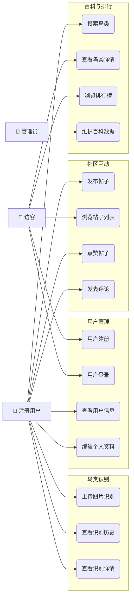
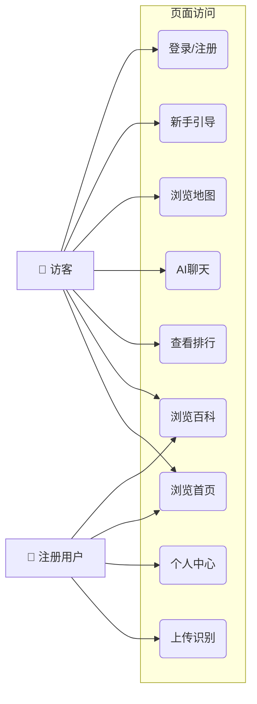
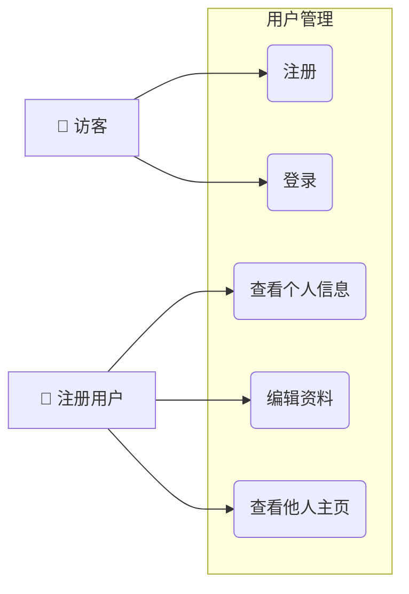
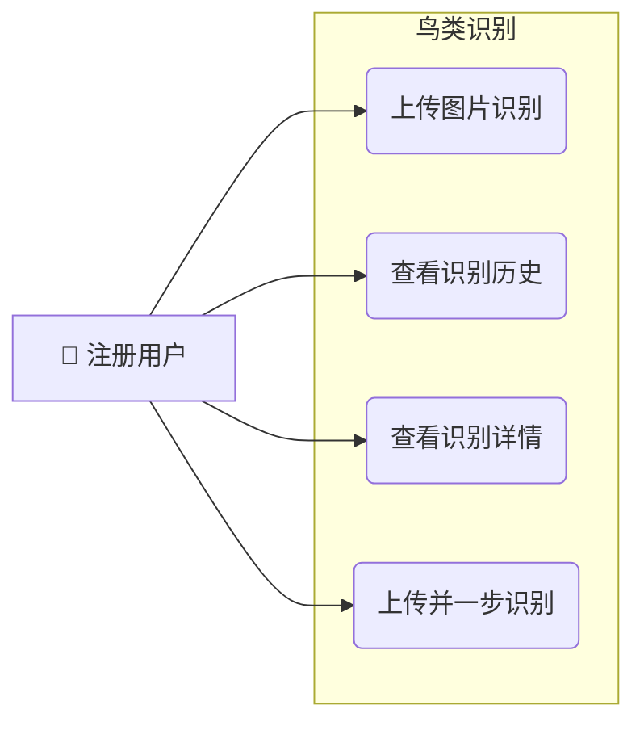
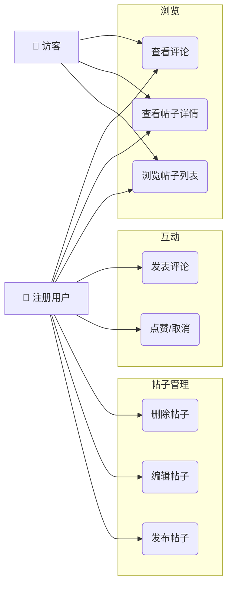
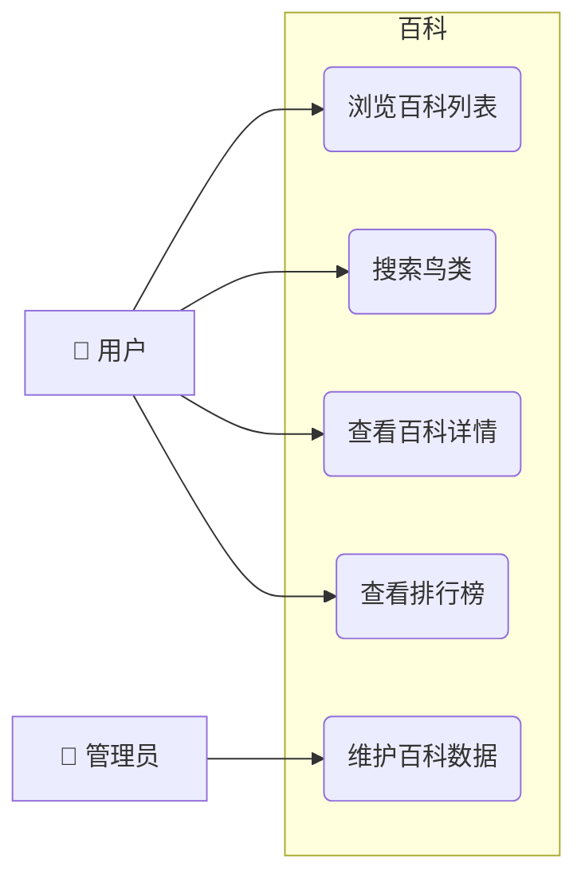
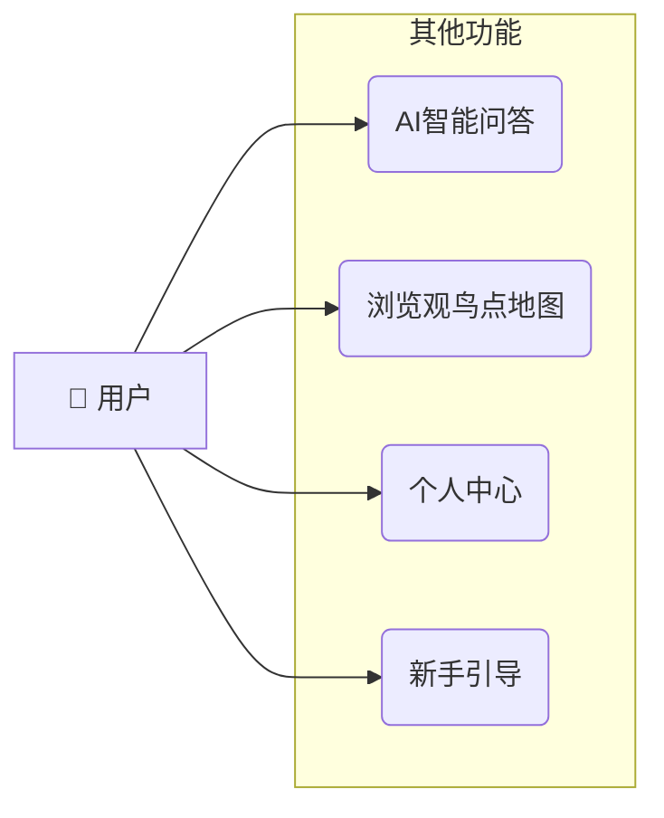

# 众翼云鉴：智能鸟类摄享平台 — 软件需求规格说明书 (SRS)

---

## 目 录

1. [引言](#1-引言)
2. [系统概述](#2-系统概述)
3. [需求规约](#3-需求规约)
4. [性能与安全需求](#4-性能与安全需求)
5. [设计约束](#5-设计约束)
6. [技术栈说明](#6-技术栈说明)
7. [外部接口设计](#7-外部接口设计)

---

## 1. 引言

### 1.1 编写目的

本文档旨在明确"众翼云鉴：智能鸟类摄享平台"的功能需求、非功能需求与外部接口需求，为项目开发、测试与验收提供依据。本文档面向项目团队、测试人员与项目评审方。

### 1.2 项目范围

本项目将原有的微信小程序"智能鸟类摄享平台"重构为功能完整的 Web 应用，提供一个集鸟类识别、社区分享、百科查询、AI 聊天、观鸟点地图于一体的综合平台。系统采用 Vue 3 + FastAPI + MySQL 技术栈，前端为响应式 Web 页面，后端提供 RESTful API 服务。

项目范围涵盖以下核心模块：
1. **用户认证系统** — 替代微信授权，实现独立账号体系
2. **鸟类识别模块** — AI 图像识别，返回 Top-3 候选结果
3. **鸟类百科模块** — 物种信息库，支持搜索与排行
4. **社区分享模块** — 帖子发布、互动与社交
5. **AI 聊天模块** — 智能问答（前端已实现，后端待对接）
6. **观鸟点地图模块** — 基于 Leaflet 的交互式地图
7. **排行榜模块** — 鸟类搜索热度排行

### 1.3 术语与定义

| 术语 | 定义 |
|------|------|
| SRS | Software Requirements Specification，软件需求规格说明书 |
| JWT | JSON Web Token，用于用户认证的令牌 |
| RESTful | 基于 HTTP 方法的 API 设计风格 |
| FastAPI | 基于 Python 3.10+ 的异步 Web 框架 |
| PBKDF2 | 密码哈希算法，用于安全存储用户密码 |

### 1.4 参考文献

- IFPUG 功能点分析报告（实验二）
- 系统边界定义图（实验二）
- 软件成本估算实验报告（实验三）
- 项目管理文档集（WBS / 甘特图 / CPM / 风险管理 / 流程优化）
- birdwing-cloud 代码仓库（最新实现）

---

## 2. 系统概述

### 2.1 总体需求分析

本系统面向鸟类爱好者和摄影爱好者，提供从识别、学习到分享的一站式服务。用户可通过上传鸟类照片获取 AI 识别结果，浏览鸟类百科知识，在社区中分享摄影作品，使用地图探索观鸟点位。

**系统边界**：
- 边界内：Vue 3 前端、FastAPI 后端、MySQL 数据库
- 边界外：浏览器用户、AI 识别服务（模拟模式 / 百度 AI）、文件存储

**核心用例**：

### 2.2 用户特征

| 用户角色 | 特征 | 使用目标 |
|---------|------|---------|
| 普通访客 | 未注册用户 | 浏览首页内容、查看百科、查看排行榜 |
| 注册用户 | 完成注册登录 | 鸟类识别、发帖互动、AI 聊天、收藏记录 |
| 管理员 | 具有管理权限的用户 | 维护百科数据、管理社区内容（规划中） |

### 2.3 运行环境约束

- 浏览器：Chrome / Firefox / Safari / Edge 最新版本
- 后端运行环境：Python 3.10+，MySQL 8.0+（支持 SQLite 降级运行）
- 部署方式：前后端分离部署，前端通过 Vite 代理或 Nginx 反向代理连接后端

---

## 3. 需求规约

### 3.1 接口需求

#### 3.1.1 用户接口

系统提供 10 个前端页面：

| 页面 | 路由 | 功能 | 需认证 |
|------|------|------|:------:|
| 首页 | `/` | 帖子列表、轮播图、导航入口 | 否 |
| 登录 | `/login` | 用户登录 | 否 |
| 注册 | `/register` | 用户注册 | 否 |
| 帖子详情 | `/post/:id` | 查看帖子完整内容与互动 | 否 |
| 上传识别 | `/upload` | 图片上传与鸟类识别 | 是 |
| 鸟类图鉴 | `/encyclopedia` | 百科浏览与搜索 | 否 |
| 排行榜 | `/ranking` | 鸟类搜索热度排行 | 否 |
| AI 聊天 | `/ai-chat` | AI 智能问答 | 否 |
| 观鸟点地图 | `/map` | 地图浏览观鸟点 | 否 |
| 位置帖子 | `/location-posts` | 按位置查看帖子 | 否 |
| 个人中心 | `/profile` | 信息编辑与记录管理 | 是 |
| 新手引导 | `/guide` | 平台功能引导 | 否 |

#### 3.1.2 API 接口

系统提供 RESTful API，详细清单见第 7 节。

#### 3.1.3 外部服务接口

| 外部服务 | 用途 | 状态 |
|---------|------|------|
| AI 鸟类识别 | 图片分析与物种识别 | 当前为内置模拟模式，可选接入百度 AI |
| 文件存储 | 图片持久化 | 本地文件系统存储 |

### 3.2 功能需求

#### 3.2.1 用户模块

| 编号 | 需求 | 描述 | 输入 | 输出 | 优先级 |
|:----:|------|------|------|------|:------:|
| FR-01 | 用户注册 | 通过用户名和密码创建账户 | username(3~50), password(6~50) | Token + 用户信息 | P0 |
| FR-02 | 用户登录 | 通过用户名和密码登录 | username, password | Token + 用户信息 | P0 |
| FR-03 | 查看用户信息 | 获取当前或指定用户基本信息 | 用户 ID（可选） | 用户基本信息 | P1 |
| FR-04 | 编辑资料 | 修改昵称、简介、头像 | 昵称/简介/头像 URL（可选） | 更新后的用户信息 | P1 |

#### 3.2.2 鸟类识别模块

| 编号 | 需求 | 描述 | 输入 | 输出 | 优先级 |
|:----:|------|------|------|------|:------:|
| FR-05 | 上传识别 | 上传图片 AI 分析，返回 Top-3 结果 | 图片文件（≤10MB，jpg/png/gif/webp） | 记录 ID、图片 URL、Top-3 结果 | P0 |
| FR-06 | 查看识别历史 | 获取当前用户识别记录列表 | 分页参数 | 记录列表 + 分页信息 | P1 |
| FR-07 | 识别详情 | 查看单条识别记录的完整信息 | 记录 ID | 完整识别结果 | P2 |
| FR-08 | 上传并一步识别 | 上传图片后直接返回识别结果 | 图片文件 | 记录 ID、图片 URL、Top-3 结果 | P0 |

#### 3.2.3 社区分享模块

| 编号 | 需求 | 描述 | 输入 | 输出 | 优先级 |
|:----:|------|------|------|------|:------:|
| FR-09 | 发布帖子 | 发布带图片的鸟类摄影帖子 | 标题(1~200)、内容、图片列表、位置 | 帖子详情 | P0 |
| FR-10 | 浏览帖子列表 | 首页按时间倒序浏览 | 分页参数 | 帖子摘要列表 | P0 |
| FR-11 | 查看帖子详情 | 查看完整帖子与互动信息 | 帖子 ID | 帖子详情（含是否已赞） | P0 |
| FR-12 | 编辑帖子 | 作者修改帖子内容 | 帖子 ID + 待更新字段 | 更新后帖子详情 | P1 |
| FR-13 | 删除帖子 | 作者删除帖子 | 帖子 ID | — | P1 |
| FR-14 | 点赞 | 点赞或取消点赞 | 帖子 ID | 点赞状态 + 点赞数 | P1 |
| FR-15 | 发表评论 | 在帖子下发表评论 | 帖子 ID + 内容(1~500) | 评论详情 | P1 |
| FR-16 | 查看评论列表 | 查看帖子评论 | 帖子 ID + 分页参数 | 评论列表 | P1 |

#### 3.2.4 鸟类百科模块

| 编号 | 需求 | 描述 | 输入 | 输出 | 优先级 |
|:----:|------|------|------|------|:------:|
| FR-17 | 浏览百科列表 | 按搜索热度罗列鸟类 | — | 鸟类基本信息列表 | P0 |
| FR-18 | 搜索鸟类 | 按名称模糊搜索 | 关键词 + 分页参数 | 匹配鸟类列表 | P0 |
| FR-19 | 查看百科详情 | 查看鸟类完整信息 | 鸟类 ID | 鸟类详情 | P0 |
| FR-20 | 排行榜 | 搜索次数降序排行 | Top-N(1~50) | 排名列表 | P1 |
| FR-21 | 管理员维护百科 | 百科数据增删改 | 鸟类数据 | 操作结果 | P3 |

#### 3.2.5 其他模块

| 编号 | 需求 | 描述 | 状态 | 优先级 |
|:----:|------|------|:----:|:------:|
| FR-22 | AI 智能问答 | 用户与 AI 助手自然语言对话，支持流式 SSE 输出，代理 DeepSeek API | 消息列表（role + content） | AI 回复（流式 SSE / 非流式 JSON） | P2 |
| FR-23 | 观鸟点地图 | 在地图上浏览观鸟点标记 | 🚧 前端已实现（Leaflet） | P2 |
| FR-24 | 个人中心 | 查看编辑个人信息，管理帖子与识别记录 | ✅ 已实现 | P1 |
| FR-25 | 新手引导 | 平台功能介绍与使用引导 | ✅ 已实现（NoobPage） | P2 |
| FR-26 | 查看帖子详情页 | 独立页面展示帖子完整内容与互动 | ✅ 已实现（PostDetail.vue） | P1 |
| FR-27 | 按位置浏览帖子 | 从地图跳转查看特定位置的所有帖子 | ✅ 已实现（LocationPosts.vue） | P2 |
| FR-28 | 弹窗发布帖子 | 模态弹窗发布帖子，支持图片预览 | ✅ 已实现（CreatePostModal.vue） | P1 |

#### 3.2.6 功能需求与 IFPUG 映射

| 编号 | 需求名称 | IFPUG 组件 | 优先级 | 实现状态 |
|:----:|---------|:----------:|:------:|:--------:|
| FR-01 | 用户注册 | EI-01 | P0 | ✅ |
| FR-02 | 用户登录 | EI-02 | P0 | ✅ |
| FR-03 | 查看用户信息 | EQ-07 / EQ-08 | P1 | ✅ |
| FR-04 | 编辑资料 | EI-03 | P1 | ✅ |
| FR-05 | 上传识别 | EI-06 / EO-01 | P0 | ✅ |
| FR-06 | 识别历史 | EQ-04 | P1 | ✅ |
| FR-07 | 识别详情 | EQ-04 | P2 | ✅ |
| FR-08 | 上传并一步识别 | EI-06 | P0 | ✅ |
| FR-09 | 发布帖子 | EI-07 | P0 | ✅ |
| FR-10 | 浏览帖子列表 | EQ-05 / EQ-12 | P0 | ✅ |
| FR-11 | 帖子详情 | EQ-05 | P0 | ✅ |
| FR-12 | 编辑帖子 | EI-08 | P1 | ✅ |
| FR-13 | 删除帖子 | EI-09 | P1 | ✅ |
| FR-14 | 点赞 | EI-12 | P1 | ✅ |
| FR-15 | 发表评论 | EI-10 | P1 | ✅ |
| FR-16 | 查看评论 | EQ-06 | P1 | ✅ |
| FR-17 | 百科列表 | — | P0 | ✅ |
| FR-18 | 搜索鸟类 | EQ-02 | P0 | ✅ |
| FR-19 | 百科详情 | EQ-01 | P0 | ✅ |
| FR-20 | 排行榜 | EO-02 | P1 | ✅ |
| FR-21 | 管理百科 | EI-18 | P3 | 📋 |
| FR-22 | AI 聊天 | EI-14 / EQ-09 | P2 | ✅ |
| FR-23 | 观鸟点地图 | EQ-10 | P2 | 🚧 |
| FR-24 | 个人中心 | EQ-07 | P1 | ✅ |
| FR-25 | 新手引导 | — | P2 | ✅ |
| FR-26 | 帖子详情页 | EQ-05 | P1 | ✅ |
| FR-27 | 位置帖子 | — | P2 | ✅ |
| FR-28 | 弹窗发帖 | EI-07 | P1 | ✅ |

### 3.3 非功能需求

#### 3.3.1 性能需求

| 需求 | 指标 | 说明 |
|------|:----:|------|
| 页面首屏加载 | < 2s | 关键交互路径 |
| API 响应时间 | < 500ms | 不含 AI 识别的常规 API |
| 图片识别响应 | < 5s | 含上传与 AI 分析全链路 |
| 并发支持 | 100+ 同时在线 | 中等规模 Web 应用 |
| 文件上传 | ≤ 10MB | jpg/png/jpeg/gif/webp |

#### 3.3.2 安全需求

| 需求 | 说明 |
|------|------|
| 密码存储 | PBKDF2_SHA256 哈希，不可逆 |
| 认证 | JWT Bearer Token，24h 过期 |
| 文件校验 | 白名单扩展名 + 大小限制 |
| 防注入 | SQLAlchemy ORM 参数化查询 |
| CORS | 跨域白名单配置 |
| 资源校验 | 帖子/评论编辑校验所有权 |

#### 3.3.3 可扩展性需求

| 需求 | 说明 |
|------|------|
| 模块化 | 后端按模块拆分路由，前端按页面组织组件 |
| 数据库降级 | 自动切换 MySQL ↔ SQLite |
| API 版本化 | FastAPI 路由前缀支持版本管理 |

#### 3.3.4 可维护性需求

| 需求 | 说明 |
|------|------|
| API 文档 | FastAPI 自动生成 OpenAPI（`/docs`、`/redoc`） |
| 自动测试 | pytest 覆盖全部接口 |
| 代码风格 | PEP 8，类型注解 |
| 版本控制 | Git + GitHub |

---

## 4. 性能与安全需求

### 4.1 性能需求

| 场景 | 目标 | 度量方式 |
|------|:----:|---------|
| 首页加载 | ≤ 2s | Lighthouse / 浏览器 DevTools |
| API 端到端延迟 | ≤ 500ms（P95） | 应用监控 |
| 并发用户 | 100+ | 负载测试 |
| 图片上传（10MB） | ≤ 3s（上传完成） | 功能测试 |
| AI 识别全链路 | ≤ 5s | 全链路计时 |

### 4.2 安全需求

| 类别 | 要求 | 实现方式 |
|------|------|---------|
| 认证 | 所有受保护 API 需携带 JWT | `get_current_user()` 依赖注入 |
| 密码 | 不可逆哈希存储 | PBKDF2_SHA256（passlib） |
| 文件上传 | 限制类型与大小 | 白名单 + 10MB 上限 |
| 跨域 | 限制允许的来源 | FastAPI CORSMiddleware |
| 注入 | 参数化查询 | SQLAlchemy ORM |
| 授权 | 资源所有者校验 | 帖子/评论操作前验证 user_id |

### 4.3 可扩展性需求

| 维度 | 当前实现 | 未来扩展方向 |
|------|---------|------------|
| 数据库 | 单节点 MySQL | 读写分离 / 分库分表 |
| 存储 | 本地文件系统 | 阿里云 OSS |
| 缓存 | 无 | Redis |
| AI 识别 | 模拟模式 | 百度 AI 正式接入 |
| 部署 | 单机 Docker | 容器编排（Kubernetes） |

### 4.4 可维护性需求

| 需求 | 说明 |
|------|------|
| 开发环境 | 前后端分离，Hot Reload |
| 测试体系 | pytest 60+ 测试用例 |
| 文档 | API 自动文档，本项目各规格说明文档 |
| 运维 | 健康检查端点 `/api/health` |
| 代码管理 | Git feature branch + PR 工作流 |

---

## 5. 设计约束

### 5.1 技术栈约束

| 层级 | 技术 | 版本约束 | 选择理由 |
|:----:|------|:--------:|---------|
| 前端框架 | Vue 3 | 3.4+ | Composition API、更好的 TypeScript 支持 |
| 前端构建 | Vite | 5+ | 快速 HMR，现代构建工具 |
| 后端框架 | FastAPI | — | 异步支持、自动 OpenAPI、Python 生态 |
| 数据库 ORM | SQLAlchemy | 2.0+ | 成熟稳定，支持多数据库 |
| 数据库 | MySQL / SQLite | 8.0+ | 主存储，SQLite 作为开发降级方案 |

### 5.2 开发环境约束

- **IDE**：VS Code / PyCharm
- **Python 版本**：3.10+
- **Node 版本**：18+
- **包管理**：pip（后端）+ npm（前端）
- **测试框架**：pytest
- **版本控制**：Git + GitHub

### 5.3 部署环境约束

- **Web 服务器**：Nginx（反向代理 + 静态资源）
- **容器化**：Docker + Docker Compose（建议）
- **CI/CD**：GitHub Actions（建议）
- **系统要求**：Linux 服务器，2C4G+

### 5.4 RESTful API 规范

| 规范 | 约定 |
|------|------|
| HTTP 方法 | GET（查询）、POST（创建）、PUT（更新）、DELETE（删除） |
| URL 路径 | `/api/{resource}`、`/api/{resource}/{id}` |
| 请求体 | `application/json`、文件上传使用 `multipart/form-data` |
| 响应格式 | `{"code": 200, "message": "success", "data": {...}}` |
| 错误格式 | `{"detail": "错误描述"}`（HTTP 状态码标识类型） |
| 状态码 | 200（成功）、400（参数错误）、401（未认证）、403（无权限）、404（不存在）、413（文件过大）、422（校验失败）、500（服务器错误） |

### 5.5 版本控制规范

- **分支策略**：`main`（生产分支）、`feature/*`（功能分支）、`hotfix/*`（紧急修复）
- **提交规范**：遵循 Conventional Commits
- **合并要求**：PR + Code Review

---

## 6. 技术栈说明

### 6.1 前端技术栈

| 技术 | 用途 | 说明 |
|------|------|------|
| Vue 3 | SPA 框架 | Composition API + `<script setup>` |
| Vue Router 4 | 客户端路由 | 路由表 + 全局导航守卫 |
| Axios | HTTP 客户端 | 请求/响应拦截自动附带 Token、401 处理 |
| SCSS | 样式预处理 | 全局样式变量 |
| Vite | 构建工具 | 开发 HMR + 生产构建 |

**前端架构要点**：
- 零外部状态管理依赖（采用 Vue 3 `reactive()` + `computed()` 实现轻量认证状态）
- 路由守卫自动处理登录跳转与重定向
- API 层统一封装，关注点分离

### 6.2 后端技术栈

| 技术 | 用途 | 说明 |
|------|------|------|
| FastAPI | Web 框架 | 异步路由、自动 OpenAPI 文档、Pydantic 校验 |
| SQLAlchemy 2.0 | ORM | 声明式模型、会话管理、多数据库支持 |
| python-jose | JWT | HS256 签名与验证 |
| passlib | 密码哈希 | PBKDF2_SHA256 算法 |
| PyMySQL | MySQL 驱动 | 同步数据库连接 |

**后端架构要点**：
- 模块化路由（users / posts / birds / upload / recognition / chat）
- 依赖注入（`get_db`、`get_current_user`、`get_optional_user`）
- 强制 + 可选双模式认证
- AI 聊天支持流式 SSE 输出（代理 OpenAI 兼容 API）

### 6.3 数据库

- **主数据库**：MySQL 8.0+
- **降级方案**：SQLite（开发/演示环境自动切换）
- **6 张业务表**：users、posts、post_likes、comments、birds、recognition_records
- **JSON 字段**：posts.images、recognition_records.result

### 6.4 部署

- **容器化方案**：Docker + Docker Compose（多容器编排）
- **反向代理**：Nginx（前端静态资源 + API 代理）
- **CI/CD**：GitHub Actions（建议）

---

## 7. 外部接口设计

### 7.1 用户服务

| 方法 | 路径 | 需认证 | 功能 |
|:----:|------|:-----:|------|
| POST | `/api/users/register` | × | 用户注册 |
| POST | `/api/users/login` | × | 用户登录 |
| GET | `/api/users/me` | ✓ | 获取当前用户信息 |
| PUT | `/api/users/me` | ✓ | 更新当前用户信息 |
| GET | `/api/users/{user_id}` | × | 获取指定用户信息 |

### 7.2 社区帖子服务

| 方法 | 路径 | 需认证 | 功能 |
|:----:|------|:-----:|------|
| POST | `/api/posts` | ✓ | 创建帖子 |
| GET | `/api/posts` | × | 获取帖子列表 |
| GET | `/api/posts/{post_id}` | × | 获取帖子详情 |
| PUT | `/api/posts/{post_id}` | ✓ | 更新帖子 |
| DELETE | `/api/posts/{post_id}` | ✓ | 删除帖子 |
| POST | `/api/posts/{post_id}/like` | ✓ | 点赞/取消点赞 |
| GET | `/api/posts/{post_id}/comments` | × | 获取评论列表 |
| POST | `/api/posts/{post_id}/comments` | ✓ | 发表评论 |

### 7.3 鸟类百科服务

| 方法 | 路径 | 需认证 | 功能 |
|:----:|------|:-----:|------|
| GET | `/api/birds/rankings` | × | 排行榜 |
| GET | `/api/birds/search` | × | 搜索鸟类 |
| GET | `/api/birds/{bird_id}` | × | 鸟类详情 |

### 7.4 AI 识别服务

| 方法 | 路径 | 需认证 | 功能 |
|:----:|------|:-----:|------|
| POST | `/api/recognition/analyze` | ✓ | AI 分析图片 URL |
| POST | `/api/recognition/analyze-with-image` | ✓ | 上传图片并识别 |
| POST | `/api/recognition/records` | ✓ | 记录识别结果 |
| GET | `/api/recognition/records` | ✓ | 获取识别记录列表 |
| GET | `/api/recognition/records/{record_id}` | ✓ | 获取记录详情 |

### 7.5 AI 聊天服务

| 方法 | 路径 | 需认证 | 功能 |
|:----:|------|:-----:|------|
| POST | `/api/chat` | × | AI 聊天（支持流式 SSE 输出） |

### 7.6 文件上传服务

| 方法 | 路径 | 需认证 | 功能 |
|:----:|------|:-----:|------|
| POST | `/api/upload/image` | × | 上传图片 |

### 7.7 系统服务

| 方法 | 路径 | 需认证 | 功能 |
|:----:|------|:-----:|------|
| GET | `/` | × | API 信息 |
| GET | `/api/health` | × | 健康检查 |
| GET | `/docs` | × | Swagger API 文档 |
| GET | `/redoc` | × | ReDoc API 文档 |

---

